# Multi-currency-real-time-exchange-rate-conversion

Group member:

Sunny

Andy

## Detailed design of the web application

### contentMenu
 
<!--[if supportFields]>TOC \o &quot;1-2&quot;
 \h \z \u <![endif]--><a href="#_bookmark0">Detailed design of the web application........................................................................................... 2</a><w:sdtPr></w:sdtPr>

 
<a
 href="#_bookmark1">system structure........................................................................................................................... 5</a>

 
<a href="#_bookmark2">the components of the system and their
 functionalities.................................................................. 5</a>

 
<![if !supportLists]>1.1 <![endif]><a href="#_bookmark3">First page/ Welcome page..................................................................................................... 6</a>

 
<![if !supportLists]>1.2&nbsp;&nbsp; <![endif]><a href="#_bookmark4">Login page........................................................................................................................... 9</a>

 
<![if !supportLists]>1.3 <![endif]><a href="#_bookmark5">User Page........................................................................................................................... 11</a>

 
<![if !supportLists]>1.4&nbsp;&nbsp;
 <![endif]><a href="#_bookmark6">Option Page....................................................................................................................... 14</a>

 
<![if !supportLists]>1.5&nbsp;&nbsp;
 <![endif]><a href="#_bookmark7">Record Page...................................................................................................................... 15</a>

 
<a
 href="#_bookmark8">Database.................................................................................................................................... 16</a>

 
<a href="#_bookmark9">programming languages.............................................................................................................. 17</a>

 
<a
 href="#_bookmark10">tools used................................................................................................................................... 18</a>

 
<a href="#_bookmark11">testing strategies
 and results....................................................................................................... 19</a>

 
<a
 href="#_bookmark12">welcome page......................................................................................................................... 19</a>

 
<a href="#_bookmark13">In login/register
 page.............................................................................................................. 20</a>

 
<a
 href="#_bookmark14">In user page................................................................................................................................ 20</a>

 
<a href="#_bookmark15">In Detail Page.......................................................................................................................... 21</a>

 
<a
 href="#_bookmark16">In select option Page............................................................................................................... 22</a>

 
<a href="#_bookmark17">In Record page,....................................................................................................................... 22</a>

 
<a href="#_bookmark18">user manual................................................................................................................................ 23</a>

 
<a
 href="#_bookmark19">installation guide for deployment user manual............................................................................. 24</a>

 
<a href="#_bookmark20">Step 1 prepare the environment.............................................................................................. 24</a>

 
<a
 href="#_bookmark21">Step 2 set up the file................................................................................................................ 24</a>

 
<a href="#_bookmark22">Step 3 setup google reCAPTCHA............................................................................................... 25</a>

 
<a
 href="#_bookmark23">Step 4 set up HTTPS................................................................................................................. 27</a>

 
<a href="#_bookmark24">Step 5 set up the SQL............................................................................................................... 27</a>

 
<!--[if supportFields]><![endif]--><o:p>&nbsp;</o:p>

</w:Sdt>

 

<h1 style='margin-top:11.35pt;line-height:normal'>Detailed design of the web application</h1>

The interface of
the web design:

<!--[if gte vml 1]><o:wrapblock><v:shape
  id="image2.png" o:spid="_x0000_s1085" type="#_x0000_t75" style='position:absolute;
  margin-left:1in;margin-top:7.75pt;width:450.05pt;height:202.95pt;z-index:251658240;
  visibility:visible;mso-wrap-style:square;mso-wrap-distance-left:0;
  mso-wrap-distance-top:0;mso-wrap-distance-right:0;mso-wrap-distance-bottom:0;
  mso-position-horizontal:absolute;mso-position-horizontal-relative:page;
  mso-position-vertical:absolute;mso-position-vertical-relative:text'>
  <v:imagedata src="final_report.files/image003.png" o:title=""/>
  <w:wrap type="topAndBottom" anchorx="page"/>
 </v:shape><![endif]--><![if !vml]>
 <table cellpadding=0 cellspacing=0 align=left>
  <tr>
   <td width=96 height=0></td>
  </tr>
  <tr>
   <td></td>
   <td>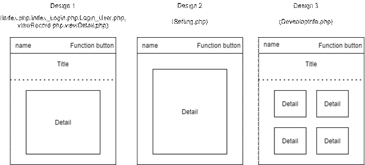</td>
  </tr>
 </table>
 <![endif]><!--[if gte vml 1]></o:wrapblock><![endif]--> 
<o:p></o:p>

 

<!--[if gte vml 1]><v:line id="_x0000_s1051"
 style='position:absolute;left:0;text-align:left;z-index:1072;
 mso-position-horizontal-relative:page;mso-position-vertical-relative:page'
 from="72.25pt,310.55pt" to="72.25pt,689.65pt" strokeweight=".48pt">
 <w:wrap anchorx="page" anchory="page"/>
</v:line><![endif]--><![if !vml]><![endif]><!--[if gte vml 1]><v:group id="_x0000_s1044"
 style='position:absolute;left:0;text-align:left;margin-left:76.3pt;
 margin-top:351.7pt;width:204.45pt;height:313.65pt;z-index:1096;
 mso-position-horizontal-relative:page;mso-position-vertical-relative:page'
 coordorigin="1526,7034" coordsize="4089,6273">
 <v:shape id="_x0000_s1050" type="#_x0000_t75" style='position:absolute;left:1553;
  top:7072;width:4039;height:6218'>
  <v:imagedata src="final_report.files/image006.jpg" o:title=""/>
 </v:shape><v:rect id="_x0000_s1049" style='position:absolute;left:1558;top:9587;
  width:4035;height:3697' filled="f" strokecolor="red" strokeweight="2.25pt"/>
 <v:rect id="_x0000_s1048" style='position:absolute;left:1755;top:9785;width:3671;
  height:2443' filled="f" strokecolor="red" strokeweight="2.25pt">
  <v:stroke dashstyle="longDash"/>
 </v:rect><v:rect id="_x0000_s1047" style='position:absolute;left:1550;top:7246;
  width:4035;height:2302' filled="f" strokecolor="#00afef" strokeweight="2.25pt"/>
 <v:rect id="_x0000_s1046" style='position:absolute;left:1549;top:7056;width:4035;
  height:186' filled="f" strokecolor="#2e5496" strokeweight="2.25pt"/>
 <v:shape id="_x0000_s1045" style='position:absolute;left:1549;top:7057;
  width:4042;height:170' coordorigin="1549,7058" coordsize="4042,170" o:spt="100"
  adj="0,,0" path="m4826,7058r765,l5591,7227r-765,l4826,7058xm1549,7059r765,l2314,7228r-765,l1549,7059xe"
  filled="f" strokecolor="#ffc000" strokeweight="2.25pt">
  <v:stroke joinstyle="round"/>
  <v:formulas/>
  <v:path arrowok="t" o:connecttype="segments"/>
 </v:shape><w:wrap anchorx="page" anchory="page"/>
</v:group><![endif]--><![if !vml]>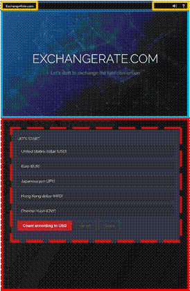<![endif]><!--[if gte vml 1]><v:group
 id="_x0000_s1036" style='position:absolute;left:0;text-align:left;
 margin-left:297.35pt;margin-top:310.55pt;width:226pt;height:379.1pt;z-index:1144;
 mso-position-horizontal-relative:page;mso-position-vertical-relative:page'
 coordorigin="5947,6211" coordsize="4520,7582">
 <v:shape id="_x0000_s1043" type="#_x0000_t75" style='position:absolute;left:6061;
  top:7061;width:4168;height:6225'>
  <v:imagedata src="final_report.files/image008.jpg" o:title=""/>
 </v:shape><v:rect id="_x0000_s1042" style='position:absolute;left:6081;top:9976;
  width:4130;height:3309' filled="f" strokecolor="red" strokeweight="2.25pt"/>
 <v:rect id="_x0000_s1041" style='position:absolute;left:6311;top:10259;
  width:3759;height:2920' filled="f" strokecolor="red" strokeweight="2.25pt">
  <v:stroke dashstyle="longDash"/>
 </v:rect><v:rect id="_x0000_s1040" style='position:absolute;left:6062;top:7262;
  width:4173;height:2705' filled="f" strokecolor="#00afef" strokeweight="2.25pt"/>
 <v:rect id="_x0000_s1039" style='position:absolute;left:6057;top:7056;width:4171;
  height:186' filled="f" strokecolor="#2e5496" strokeweight="2.25pt"/>
 <v:shape id="_x0000_s1038" style='position:absolute;left:6118;top:7075;
  width:4118;height:169' coordorigin="6118,7076" coordsize="4118,169" o:spt="100"
  adj="0,,0" path="m6118,7076r765,l6883,7245r-765,l6118,7076xm9471,7076r765,l10236,7245r-765,l9471,7076xe"
  filled="f" strokecolor="#ffc000" strokeweight="2.25pt">
  <v:stroke joinstyle="round"/>
  <v:formulas/>
  <v:path arrowok="t" o:connecttype="segments"/>
 </v:shape><v:shapetype id="_x0000_t202" coordsize="21600,21600" o:spt="202"
  path="m,l,21600r21600,l21600,xe">
  <v:stroke joinstyle="miter"/>
  <v:path gradientshapeok="t" o:connecttype="rect"/>
 </v:shapetype><v:shape id="_x0000_s1037" type="#_x0000_t202" style='position:absolute;
  left:5952;top:6216;width:4510;height:7572' filled="f" strokeweight=".16969mm">
  <v:textbox inset="0,0,0,0">
   <![if !mso]>
   <table cellpadding=0 cellspacing=0 width="100%">
    <tr>
     <td><![endif]>
     

     
This is the use show in
     table/desktop computer<o:p></o:p>

     

     <![if !mso]></td>
    </tr>
   </table>
   <![endif]></v:textbox>
 </v:shape><w:wrap anchorx="page" anchory="page"/>
</v:group><![endif]--><![if !vml]>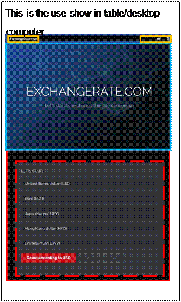<![endif]><!--[if gte vml 1]><v:shape
 id="_x0000_s1035" type="#_x0000_t202" style='position:absolute;left:0;
 text-align:left;margin-left:77.65pt;margin-top:314.15pt;width:174.65pt;
 height:12.35pt;z-index:1168;mso-position-horizontal-relative:page;
 mso-position-vertical-relative:page' filled="f" stroked="f">
 <v:textbox inset="0,0,0,0"/>
 <w:wrap anchorx="page" anchory="page"/>
</v:shape><![endif]--><![if !vml]>

<table cellpadding=0 cellspacing=0>
 <tr>
  <td width=236 height=20 style='vertical-align:top'><![endif]><![if !mso]>
  <table cellpadding=0 cellspacing=0 width="100%">
   <tr>
    <td><![endif]>
    

    
This is the UI show in mobile phone<o:p></o:p>

    

    <![if !mso]></td>
   </tr>
  </table>
  <![endif]><![if !mso & !vml]>&nbsp;<![endif]><![if !vml]></td>
 </tr>
</table>

<![endif]>Support mobile phone/table/desktop screen
size

<!--[if gte vml 1]><o:wrapblock><v:shape
  id="image5.png" o:spid="_x0000_s1084" type="#_x0000_t75" style='position:absolute;
  margin-left:1in;margin-top:7.75pt;width:242.8pt;height:183.95pt;z-index:251660288;
  visibility:visible;mso-wrap-style:square;mso-wrap-distance-left:0;
  mso-wrap-distance-top:0;mso-wrap-distance-right:0;mso-wrap-distance-bottom:0;
  mso-position-horizontal:absolute;mso-position-horizontal-relative:page;
  mso-position-vertical:absolute;mso-position-vertical-relative:text'>
  <v:imagedata src="final_report.files/image010.png" o:title=""/>
  <w:wrap type="topAndBottom" anchorx="page"/>
 </v:shape><![endif]--><![if !vml]>
 <table cellpadding=0 cellspacing=0 align=left>
  <tr>
   <td width=96 height=0></td>
  </tr>
  <tr>
   <td></td>
   <td>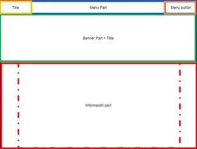</td>
  </tr>
 </table>
 <![endif]><!--[if gte vml 1]></o:wrapblock><![endif]--> 
<o:p></o:p>

 

Support Dark Mode

<table class=TableNormal border=1 cellspacing=0 cellpadding=0 style='margin-left:
 60.5pt;border-collapse:collapse;mso-table-layout-alt:fixed;border:none;
 mso-border-alt:solid black .5pt;mso-yfti-tbllook:480;mso-padding-alt:0cm 0cm 0cm 0cm;
 mso-border-insideh:.5pt solid black;mso-border-insidev:.5pt solid black'>
 <tr style='mso-yfti-irow:0;mso-yfti-firstrow:yes;height:17.95pt'>
  <td width=300 valign=top style='width:225.35pt;border:solid black 1.0pt;
  mso-border-alt:solid black .5pt;padding:0cm 0cm 0cm 0cm;height:17.95pt'>
  
Light mode<o:p></o:p>

  </td>
  <td width=301 valign=top style='width:225.45pt;border:solid black 1.0pt;
  border-left:none;mso-border-left-alt:solid black .5pt;mso-border-alt:solid black .5pt;
  padding:0cm 0cm 0cm 0cm;height:17.95pt'>
  
Dark mode<o:p></o:p>

  </td>
 </tr>
 <tr style='mso-yfti-irow:1;height:270.1pt'>
  <td width=300 valign=top style='width:225.35pt;border:solid black 1.0pt;
  border-top:none;mso-border-top-alt:solid black .5pt;mso-border-alt:solid black .5pt;
  padding:0cm 0cm 0cm 0cm;height:270.1pt'>
  
<o:p>&nbsp;</o:p>

  
<!--[if gte vml 1]><v:shape
   id="image6.jpeg" o:spid="_x0000_i1069" type="#_x0000_t75" style='width:200.25pt;
   height:258pt;visibility:visible;mso-wrap-style:square'>
   <v:imagedata src="final_report.files/image012.jpg" o:title=""/>
  </v:shape><![endif]--><![if !vml]><![endif]><o:p></o:p>

  </td>
  <td width=301 valign=top style='width:225.45pt;border-top:none;border-left:
  none;border-bottom:solid black 1.0pt;border-right:solid black 1.0pt;
  mso-border-top-alt:solid black .5pt;mso-border-left-alt:solid black .5pt;
  mso-border-alt:solid black .5pt;padding:0cm 0cm 0cm 0cm;height:270.1pt'>
  
<o:p>&nbsp;</o:p>

  
<!--[if gte vml 1]><v:shape
   id="image7.jpeg" o:spid="_x0000_i1068" type="#_x0000_t75" style='width:204pt;
   height:264.75pt;visibility:visible;mso-wrap-style:square'>
   <v:imagedata src="final_report.files/image014.jpg" o:title=""/>
  </v:shape><![endif]--><![if !vml]><![endif]><o:p></o:p>

  </td>
 </tr>
 <tr style='mso-yfti-irow:2;mso-yfti-lastrow:yes;height:269.95pt'>
  <td width=300 valign=top style='width:225.35pt;border:solid black 1.0pt;
  border-top:none;mso-border-top-alt:solid black .5pt;mso-border-alt:solid black .5pt;
  padding:0cm 0cm 0cm 0cm;height:269.95pt'>
  
<o:p>&nbsp;</o:p>

  
<!--[if gte vml 1]><v:shape
   id="image8.jpeg" o:spid="_x0000_i1067" type="#_x0000_t75" style='width:201pt;
   height:261.75pt;visibility:visible;mso-wrap-style:square'>
   <v:imagedata src="final_report.files/image016.jpg" o:title=""/>
  </v:shape><![endif]--><![if !vml]><![endif]><o:p></o:p>

  </td>
  <td width=301 valign=top style='width:225.45pt;border-top:none;border-left:
  none;border-bottom:solid black 1.0pt;border-right:solid black 1.0pt;
  mso-border-top-alt:solid black .5pt;mso-border-left-alt:solid black .5pt;
  mso-border-alt:solid black .5pt;padding:0cm 0cm 0cm 0cm;height:269.95pt'>
  
<o:p>&nbsp;</o:p>

  
<!--[if gte vml 1]><v:shape
   id="image9.jpeg" o:spid="_x0000_i1066" type="#_x0000_t75" style='width:201pt;
   height:261pt;visibility:visible;mso-wrap-style:square'>
   <v:imagedata src="final_report.files/image018.jpg" o:title=""/>
  </v:shape><![endif]--><![if !vml]><![endif]><o:p></o:p>

  </td>
 </tr>
</table>

 

<o:p>&nbsp;</o:p>

<h1>system
structure</h1>

<o:p>&nbsp;</o:p>

<o:p>&nbsp;</o:p>

<o:p>&nbsp;</o:p>

<!--[if gte vml 1]><o:wrapblock><v:shape
  id="image10.png" o:spid="_x0000_s1083" type="#_x0000_t75" style='position:absolute;
  margin-left:1in;margin-top:8.3pt;width:451.3pt;height:363pt;z-index:7;
  visibility:visible;mso-wrap-style:square;mso-wrap-distance-left:0;
  mso-wrap-distance-top:0;mso-wrap-distance-right:0;mso-wrap-distance-bottom:0;
  mso-position-horizontal:absolute;mso-position-horizontal-relative:page;
  mso-position-vertical:absolute;mso-position-vertical-relative:text'>
  <v:imagedata src="final_report.files/image020.gif" o:title=""/>
  <w:wrap type="topAndBottom" anchorx="page"/>
 </v:shape><![endif]--><![if !vml]>
 <table cellpadding=0 cellspacing=0 align=left>
  <tr>
   <td width=96 height=0></td>
  </tr>
  <tr>
   <td></td>
   <td>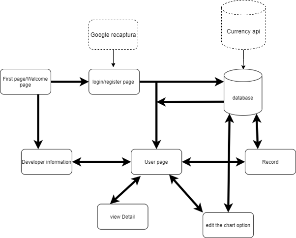</td>
  </tr>
 </table>
 <![endif]><!--[if gte vml 1]></o:wrapblock><![endif]--> 
<o:p></o:p>

<o:p>&nbsp;</o:p>

<h1 style='line-height:170%'>the components of the system and their
functionalities</h1>

In this system There are six components, which are First page, Login
or register page, User page, Record page, option page, view detail page and
Developer information page. And We design the website can visit from different
end-device.

 

<o:p>&nbsp;</o:p>

<o:p>&nbsp;</o:p>

<h2 style='margin-left:90.3pt;text-indent:-30.3pt;mso-list:l1 level2 lfo2;
tab-stops:90.35pt'><![if !supportLists]>1.1 <![endif]>First page/ Welcome page</h2>

<!--[if gte vml 1]><o:wrapblock><v:shape
  id="image11.jpeg" o:spid="_x0000_s1082" type="#_x0000_t75" style='position:absolute;
  margin-left:1in;margin-top:19.15pt;width:326.85pt;height:127.8pt;z-index:8;
  visibility:visible;mso-wrap-style:square;mso-wrap-distance-left:0;
  mso-wrap-distance-top:0;mso-wrap-distance-right:0;mso-wrap-distance-bottom:0;
  mso-position-horizontal:absolute;mso-position-horizontal-relative:page;
  mso-position-vertical:absolute;mso-position-vertical-relative:text'>
  <v:imagedata src="final_report.files/image021.jpg" o:title=""/>
  <w:wrap type="topAndBottom" anchorx="page"/>
 </v:shape><![endif]--><![if !vml]>
 <table cellpadding=0 cellspacing=0 align=left>
  <tr>
   <td width=96 height=0></td>
  </tr>
  <tr>
   <td></td>
   <td></td>
  </tr>
 </table>
 <![endif]><!--[if gte vml 1]></o:wrapblock><![endif]--> 
<o:p></o:p>

Picture1.1.1

<!--[if gte vml 1]><v:shape
 id="image12.png" o:spid="_x0000_s1081" type="#_x0000_t75" style='position:absolute;
 left:0;text-align:left;margin-left:222.9pt;margin-top:24.1pt;width:26.1pt;
 height:23.4pt;z-index:-1879074633;visibility:visible;mso-wrap-style:square;
 mso-wrap-distance-left:0;mso-wrap-distance-top:0;mso-wrap-distance-right:0;
 mso-wrap-distance-bottom:0;mso-position-horizontal:absolute;
 mso-position-horizontal-relative:page;mso-position-vertical:absolute;
 mso-position-vertical-relative:text'>
 <v:imagedata src="final_report.files/image023.png" o:title=""/>
 <w:wrap anchorx="page"/>
</v:shape><![endif]--><![if !vml]><![endif]><!--[if gte vml 1]><v:shape
 id="_x0000_s1080" type="#_x0000_t75" style='position:absolute;left:0;
 text-align:left;margin-left:319.95pt;margin-top:60.1pt;width:26.1pt;height:23.4pt;
 z-index:-1879074609;visibility:visible;mso-wrap-style:square;
 mso-wrap-distance-left:0;mso-wrap-distance-top:0;mso-wrap-distance-right:0;
 mso-wrap-distance-bottom:0;mso-position-horizontal:absolute;
 mso-position-horizontal-relative:page;mso-position-vertical:absolute;
 mso-position-vertical-relative:text'>
 <v:imagedata src="final_report.files/image023.png" o:title=""/>
 <w:wrap anchorx="page"/>
</v:shape><![endif]--><![if !vml]><![endif]>In Welcome page(Picture1.1.1), It make by two part .First
part is title page . User can direct
to other page by click &nbsp;<!--[if gte vml 1]><v:shape id="_x0000_i1065" type="#_x0000_t75"
 style='width:30pt;height:22.5pt;visibility:visible;mso-wrap-style:square'>
 <v:imagedata src="final_report.files/image025.png" o:title=""/>
</v:shape><![endif]--><![if !vml]><![endif]>/&nbsp;&nbsp;&nbsp;&nbsp;&nbsp;&nbsp;&nbsp;&nbsp;&nbsp;&nbsp;&nbsp;&nbsp;&nbsp;&nbsp;&nbsp;&nbsp;&nbsp;&nbsp;&nbsp;&nbsp;&nbsp;&nbsp;&nbsp;&nbsp;&nbsp;&nbsp;&nbsp; button.
User can click “login/register” button to login
or register&nbsp; <!--[if gte vml 1]><v:shape id="image13.png" o:spid="_x0000_i1064"
 type="#_x0000_t75" style='width:30pt;height:22.5pt;visibility:visible;
 mso-wrap-style:square'>
 <v:imagedata src="final_report.files/image025.png" o:title=""/>
</v:shape><![endif]--><![if !vml]><![endif]>.Or
“website information” button&nbsp;&nbsp;&nbsp;&nbsp;&nbsp;&nbsp;&nbsp;&nbsp;&nbsp;&nbsp;&nbsp;&nbsp;&nbsp;&nbsp;&nbsp;&nbsp;&nbsp;&nbsp;&nbsp;&nbsp;&nbsp;&nbsp;&nbsp;&nbsp;&nbsp;&nbsp;&nbsp;&nbsp;&nbsp;&nbsp;&nbsp;&nbsp;&nbsp;&nbsp;&nbsp;&nbsp;&nbsp;&nbsp;&nbsp;&nbsp;&nbsp;&nbsp;&nbsp;&nbsp;&nbsp;&nbsp;&nbsp;&nbsp;&nbsp;&nbsp;&nbsp;&nbsp;&nbsp;&nbsp;&nbsp;&nbsp;&nbsp;&nbsp;&nbsp;&nbsp; to
know information about the

website. Click To enhance to showcase in the web page We also had
added three-layer and

precedence in the front cover.

<o:p>&nbsp;</o:p>

<!--[if gte vml 1]><o:wrapblock><v:shape id="image14.jpeg"
  o:spid="_x0000_s1079" type="#_x0000_t75" style='position:absolute;left:0;
  text-align:left;margin-left:1in;margin-top:17.15pt;width:323.4pt;height:124.7pt;
  z-index:9;visibility:visible;mso-wrap-style:square;mso-wrap-distance-left:0;
  mso-wrap-distance-top:0;mso-wrap-distance-right:0;mso-wrap-distance-bottom:0;
  mso-position-horizontal:absolute;mso-position-horizontal-relative:page;
  mso-position-vertical:absolute;mso-position-vertical-relative:text'>
  <v:imagedata src="final_report.files/image027.jpg" o:title=""/>
  <w:wrap type="topAndBottom" anchorx="page"/>
 </v:shape><![endif]--><![if !vml]>
 <table cellpadding=0 cellspacing=0>
  <tr>
   <td width=96 height=0></td>
  </tr>
  <tr>
   <td></td>
   <td></td>
  </tr>
 </table>
 <![endif]><!--[if gte vml 1]></o:wrapblock><![endif]--> 
First, User would not see anything in the front cover at the
began(Picture 1.1.2):

Picture1.1.2

Second, The front
cover would display the string (Picture 1.1.3):

 

<!--[if gte vml 1]><v:shape
 id="image15.jpeg" o:spid="_x0000_i1063" type="#_x0000_t75" style='width:369pt;
 height:141pt;visibility:visible;mso-wrap-style:square'>
 <v:imagedata src="final_report.files/image029.jpg" o:title=""/>
</v:shape><![endif]--><![if !vml]><![endif]><o:p></o:p>

Picture 1.1.3

Third, It would display clear background picture(Picture 1.1.4):

<!--[if gte vml 1]><o:wrapblock><v:shape
  id="image16.jpeg" o:spid="_x0000_s1078" type="#_x0000_t75" style='position:absolute;
  margin-left:1in;margin-top:9.85pt;width:370pt;height:143.65pt;z-index:12;
  visibility:visible;mso-wrap-style:square;mso-wrap-distance-left:0;
  mso-wrap-distance-top:0;mso-wrap-distance-right:0;mso-wrap-distance-bottom:0;
  mso-position-horizontal:absolute;mso-position-horizontal-relative:page;
  mso-position-vertical:absolute;mso-position-vertical-relative:text'>
  <v:imagedata src="final_report.files/image031.jpg" o:title=""/>
  <w:wrap type="topAndBottom" anchorx="page"/>
 </v:shape><![endif]--><![if !vml]>
 <table cellpadding=0 cellspacing=0 align=left>
  <tr>
   <td width=96 height=0></td>
  </tr>
  <tr>
   <td></td>
   <td></td>
  </tr>
 </table>
 <![endif]><!--[if gte vml 1]></o:wrapblock><![endif]--> 
<o:p></o:p>

Picture 1.1.4

<o:p>&nbsp;</o:p>

<!--[if gte vml 1]><o:wrapblock><v:shape
  id="image17.png" o:spid="_x0000_s1077" type="#_x0000_t75" style='position:absolute;
  margin-left:1in;margin-top:9.45pt;width:237.5pt;height:139.25pt;z-index:13;
  visibility:visible;mso-wrap-style:square;mso-wrap-distance-left:0;
  mso-wrap-distance-top:0;mso-wrap-distance-right:0;mso-wrap-distance-bottom:0;
  mso-position-horizontal:absolute;mso-position-horizontal-relative:page;
  mso-position-vertical:absolute;mso-position-vertical-relative:text'>
  <v:imagedata src="final_report.files/image033.png" o:title=""/>
  <w:wrap type="topAndBottom" anchorx="page"/>
 </v:shape><![endif]--><![if !vml]>
 <table cellpadding=0 cellspacing=0 align=left>
  <tr>
   <td width=96 height=0></td>
  </tr>
  <tr>
   <td></td>
   <td>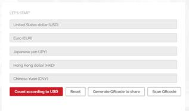</td>
  </tr>
 </table>
 <![endif]><!--[if gte vml 1]></o:wrapblock><![endif]--> 
<o:p></o:p>

Picture1.1.5

The second part (Picture1.1.5) in Welcome page, User can use the
bitcoin calculator in this part. The calculator can get the real-time data from
internet and output in the calculator. The page would look like
this(Picture1.1.6):

 

<o:p>&nbsp;</o:p>

<!--[if gte vml 1]><v:shape
 id="image18.png" o:spid="_x0000_i1062" type="#_x0000_t75" style='width:315pt;
 height:155.25pt;visibility:visible;mso-wrap-style:square'>
 <v:imagedata src="final_report.files/image035.png" o:title=""/>
</v:shape><![endif]--><![if !vml]>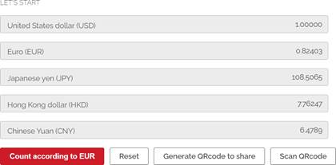<![endif]><o:p></o:p>

<o:p>&nbsp;</o:p>

Picture1.1.6(The
case of User enter 1 in USD row)

<o:p>&nbsp;</o:p>

<!--[if gte vml 1]><v:shape
 id="image19.png" o:spid="_x0000_s1076" type="#_x0000_t75" style='position:absolute;
 left:0;text-align:left;margin-left:356.3pt;margin-top:74.75pt;width:135.5pt;
 height:21.8pt;z-index:-1879074513;visibility:visible;mso-wrap-style:square;
 mso-wrap-distance-left:0;mso-wrap-distance-top:0;mso-wrap-distance-right:0;
 mso-wrap-distance-bottom:0;mso-position-horizontal:absolute;
 mso-position-horizontal-relative:page;mso-position-vertical:absolute;
 mso-position-vertical-relative:text'>
 <v:imagedata src="final_report.files/image037.png" o:title=""/>
 <w:wrap anchorx="page"/>
</v:shape><![endif]--><![if !vml]><![endif]>In this part user can enter the number one of the rows than click the Red
button <!--[if gte vml 1]><v:shape id="image20.png" o:spid="_x0000_i1061"
 type="#_x0000_t75" style='width:87pt;height:15pt;visibility:visible;
 mso-wrap-style:square'>
 <v:imagedata src="final_report.files/image039.png" o:title=""/>
</v:shape><![endif]--><![if !vml]><![endif]>.
That can count the dollar by your Currency Converter.
The name of the Red button would allow the User input action, such as if
user enter value in Hong Kong

<o:p>&nbsp;</o:p>

dollar ,than the button would be count according to HKD&nbsp;&nbsp;&nbsp;&nbsp;&nbsp;&nbsp;&nbsp;&nbsp;&nbsp;&nbsp;&nbsp;&nbsp;&nbsp;&nbsp;&nbsp;&nbsp;&nbsp;&nbsp;&nbsp;&nbsp;&nbsp;&nbsp;&nbsp;&nbsp;&nbsp;&nbsp;&nbsp;&nbsp;&nbsp;&nbsp;&nbsp;&nbsp;&nbsp;&nbsp;&nbsp;&nbsp;&nbsp;&nbsp;&nbsp;&nbsp;&nbsp;&nbsp;&nbsp;&nbsp;&nbsp;&nbsp;&nbsp;&nbsp; .
Then user can click the” Reset” button to reset all the output.
If user want to output
the webpage URL and share to their friend,
User can “Generate
QRcode to share “button to

generate the QRcode
(Picture 1.1.7):

<!--[if gte vml 1]><o:wrapblock><v:shape
  id="image21.png" o:spid="_x0000_s1075" type="#_x0000_t75" style='position:absolute;
  margin-left:228.1pt;margin-top:12.75pt;width:132.2pt;height:132.2pt;
  z-index:14;visibility:visible;mso-wrap-style:square;mso-wrap-distance-left:0;
  mso-wrap-distance-top:0;mso-wrap-distance-right:0;mso-wrap-distance-bottom:0;
  mso-position-horizontal:absolute;mso-position-horizontal-relative:page;
  mso-position-vertical:absolute;mso-position-vertical-relative:text'>
  <v:imagedata src="final_report.files/image041.png" o:title=""/>
  <w:wrap type="topAndBottom" anchorx="page"/>
 </v:shape><![endif]--><![if !vml]>
 <table cellpadding=0 cellspacing=0 align=left>
  <tr>
   <td width=304 height=0></td>
  </tr>
  <tr>
   <td></td>
   <td></td>
  </tr>
 </table>
 <![endif]><!--[if gte vml 1]></o:wrapblock><![endif]--> 
<o:p></o:p>

<o:p>&nbsp;</o:p>

Picture
1.1.7

Then If user want to scan the QR code for visit the page to get the
pass research setting. User can click the “Scan QRcode
button” and scan the Qrcode on the page. After
scanning the QR code user would direct to access the new page which they had
save the search option before.

 

<o:p>&nbsp;</o:p>

<!--[if gte vml 1]><v:shape
 id="image22.jpeg" o:spid="_x0000_i1060" type="#_x0000_t75" style='width:197.25pt;
 height:116.25pt;visibility:visible;mso-wrap-style:square'>
 <v:imagedata src="final_report.files/image043.jpg" o:title=""/>
</v:shape><![endif]--><![if !vml]>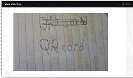<![endif]><o:p></o:p>

<o:p>&nbsp;</o:p>

<h2 style='margin-top:.15pt;margin-right:0cm;margin-bottom:0cm;margin-left:
95.6pt;margin-bottom:.0001pt;text-indent:-35.6pt;mso-list:l1 level2 lfo2;
tab-stops:95.65pt'><![if !supportLists]>1.2&nbsp;&nbsp;&nbsp;&nbsp;
<![endif]>Login page</h2>

<o:p>&nbsp;</o:p>

<!--[if gte vml 1]><o:wrapblock><v:shape
  id="image23.jpeg" o:spid="_x0000_s1074" type="#_x0000_t75" style='position:absolute;
  left:0;text-align:left;margin-left:179.8pt;margin-top:59.15pt;width:232.95pt;
  height:182.05pt;z-index:16;visibility:visible;mso-wrap-style:square;
  mso-wrap-distance-left:0;mso-wrap-distance-top:0;mso-wrap-distance-right:0;
  mso-wrap-distance-bottom:0;mso-position-horizontal:absolute;
  mso-position-horizontal-relative:page;mso-position-vertical:absolute;
  mso-position-vertical-relative:text'>
  <v:imagedata src="final_report.files/image045.jpg" o:title=""/>
  <w:wrap type="topAndBottom" anchorx="page"/>
 </v:shape><![endif]--><![if !vml]>
 <table cellpadding=0 cellspacing=0>
  <tr>
   <td width=240 height=0></td>
  </tr>
  <tr>
   <td></td>
   <td></td>
  </tr>
 </table>
 <![endif]><!--[if gte vml 1]></o:wrapblock><![endif]--> 
If user want to login or register an account forget more
information about bitcoin. They could do the login or register action from this
page. The page would look like this (Picture1.2.1):

Picture1.2.1

<o:p>&nbsp;</o:p>

In this page
user had to enter login id and Password for register or login.

If user want to register an account, they need to enter the login Id
and password than click the “Create an account” button.

If user want to login the account, they would
need to enter the login Id and password than click the “Login” button.

And every time user login or register a new account ,they need to
click the google ReCAPTCHA checkbox.

There are number of cases would happen:

 

<table class=TableNormal border=1 cellspacing=0 cellpadding=0 style='margin-left:
 60.5pt;border-collapse:collapse;mso-table-layout-alt:fixed;border:none;
 mso-border-alt:solid black .5pt;mso-yfti-tbllook:480;mso-padding-alt:0cm 0cm 0cm 0cm;
 mso-border-insideh:.5pt solid black;mso-border-insidev:.5pt solid black'>
 <tr style='mso-yfti-irow:0;mso-yfti-firstrow:yes;height:107.95pt'>
  <td width=206 valign=top style='width:154.2pt;border:solid black 1.0pt;
  mso-border-alt:solid black .5pt;padding:0cm 0cm 0cm 0cm;height:107.95pt'>
  
If user
  success create a new account<o:p></o:p>

  </td>
  <td width=303 valign=top style='width:227.4pt;border:solid black 1.0pt;
  border-left:none;mso-border-left-alt:solid black .5pt;mso-border-alt:solid black .5pt;
  padding:0cm 0cm 0cm 0cm;height:107.95pt'>
  
<o:p>&nbsp;</o:p>

  
<!--[if gte vml 1]><v:shape
   id="_x0000_i1059" type="#_x0000_t75" style='width:209.25pt;height:60.75pt;
   visibility:visible;mso-wrap-style:square'>
   <v:imagedata src="final_report.files/image047.png" o:title=""/>
  </v:shape><![endif]--><![if !vml]><![endif]><o:p></o:p>

  
The webpage
  would direit to user page and alert a success login
  message.<o:p></o:p>

  </td>
 </tr>
 <tr style='mso-yfti-irow:1;height:126.1pt'>
  <td width=206 valign=top style='width:154.2pt;border:solid black 1.0pt;
  border-top:none;mso-border-top-alt:solid black .5pt;mso-border-alt:solid black .5pt;
  padding:0cm 0cm 0cm 0cm;height:126.1pt'>
  
If user doesn’t enter the password to login or create account<o:p></o:p>

  </td>
  <td width=303 valign=top style='width:227.4pt;border-top:none;border-left:
  none;border-bottom:solid black 1.0pt;border-right:solid black 1.0pt;
  mso-border-top-alt:solid black .5pt;mso-border-left-alt:solid black .5pt;
  mso-border-alt:solid black .5pt;padding:0cm 0cm 0cm 0cm;height:126.1pt'>
  
<o:p>&nbsp;</o:p>

  
<!--[if gte vml 1]><v:shape
   id="_x0000_i1058" type="#_x0000_t75" style='width:217.5pt;height:64.5pt;
   visibility:visible;mso-wrap-style:square'>
   <v:imagedata src="final_report.files/image049.png" o:title=""/>
  </v:shape><![endif]--><![if !vml]>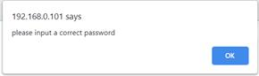<![endif]><o:p></o:p>

  
The webpage would alert a password error message.<o:p></o:p>

  </td>
 </tr>
 <tr style='mso-yfti-irow:2;mso-yfti-lastrow:yes;height:125.95pt'>
  <td width=206 valign=top style='width:154.2pt;border:solid black 1.0pt;
  border-top:none;mso-border-top-alt:solid black .5pt;mso-border-alt:solid black .5pt;
  padding:0cm 0cm 0cm 0cm;height:125.95pt'>
  
If user doesn’t click the checkbox for google ReCAPTCHA<o:p></o:p>

  </td>
  <td width=303 valign=top style='width:227.4pt;border-top:none;border-left:
  none;border-bottom:solid black 1.0pt;border-right:solid black 1.0pt;
  mso-border-top-alt:solid black .5pt;mso-border-left-alt:solid black .5pt;
  mso-border-alt:solid black .5pt;padding:0cm 0cm 0cm 0cm;height:125.95pt'>
  
<o:p>&nbsp;</o:p>

  
<!--[if gte vml 1]><v:shape
   id="_x0000_i1057" type="#_x0000_t75" style='width:200.25pt;height:58.5pt;
   visibility:visible;mso-wrap-style:square'>
   <v:imagedata src="final_report.files/image051.png" o:title=""/>
  </v:shape><![endif]--><![if !vml]>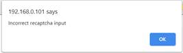<![endif]><o:p></o:p>

  
The webpage would alert a google ReCAPTCHA error message.<o:p></o:p>

  </td>
 </tr>
</table>

 

<o:p>&nbsp;</o:p>

<h2 style='margin-left:90.3pt;text-indent:-30.3pt;mso-list:l1 level2 lfo2;
tab-stops:90.35pt'><![if !supportLists]>1.3 <![endif]>User Page</h2>

<!--[if gte vml 1]><o:wrapblock><v:shape
  id="image27.png" o:spid="_x0000_s1073" type="#_x0000_t75" style='position:absolute;
  margin-left:80.65pt;margin-top:18.7pt;width:430.55pt;height:274.7pt;
  z-index:17;visibility:visible;mso-wrap-style:square;mso-wrap-distance-left:0;
  mso-wrap-distance-top:0;mso-wrap-distance-right:0;mso-wrap-distance-bottom:0;
  mso-position-horizontal:absolute;mso-position-horizontal-relative:page;
  mso-position-vertical:absolute;mso-position-vertical-relative:text'>
  <v:imagedata src="final_report.files/image053.png" o:title=""/>
  <w:wrap type="topAndBottom" anchorx="page"/>
 </v:shape><![endif]--><![if !vml]>
 <table cellpadding=0 cellspacing=0 align=left>
  <tr>
   <td width=108 height=0></td>
  </tr>
  <tr>
   <td></td>
   <td>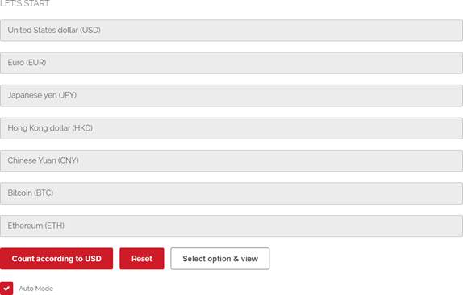</td>
  </tr>
 </table>
 <![endif]><!--[if gte vml 1]></o:wrapblock><![endif]--> 
<o:p></o:p>

Picture1.3.1

<!--[if gte vml 1]><v:shape
 id="image28.png" o:spid="_x0000_s1072" type="#_x0000_t75" style='position:absolute;
 left:0;text-align:left;margin-left:74.7pt;margin-top:43.65pt;width:93.35pt;
 height:23pt;z-index:-1879074417;visibility:visible;mso-wrap-style:square;
 mso-wrap-distance-left:0;mso-wrap-distance-top:0;mso-wrap-distance-right:0;
 mso-wrap-distance-bottom:0;mso-position-horizontal:absolute;
 mso-position-horizontal-relative:page;mso-position-vertical:absolute;
 mso-position-vertical-relative:text'>
 <v:imagedata src="final_report.files/image055.png" o:title=""/>
 <w:wrap anchorx="page"/>
</v:shape><![endif]--><![if !vml]><![endif]>In this User page (Picture1.3.1), user can do the Currency Converter
with bitcoin or ETH. The table can display seven row data at the same time. And
If user clicked the “Auto Mode”

<o:p>&nbsp;</o:p>

button. User wouldn’t need to click Currency Converter button, the value would auto show in the row.

<!--[if gte vml 1]><v:shape
 id="image29.png" o:spid="_x0000_s1071" type="#_x0000_t75" style='position:absolute;
 left:0;text-align:left;margin-left:155.95pt;margin-top:22.3pt;width:84.85pt;
 height:18.65pt;z-index:-1879074393;visibility:visible;mso-wrap-style:square;
 mso-wrap-distance-left:0;mso-wrap-distance-top:0;mso-wrap-distance-right:0;
 mso-wrap-distance-bottom:0;mso-position-horizontal:absolute;
 mso-position-horizontal-relative:page;mso-position-vertical:absolute;
 mso-position-vertical-relative:text'>
 <v:imagedata src="final_report.files/image057.png" o:title=""/>
 <w:wrap anchorx="page"/>
</v:shape><![endif]--><![if !vml]><![endif]>Then, If user want to know more detail in
the Currency converter. They can click “Select

<o:p>&nbsp;</o:p>

<!--[if gte vml 1]><o:wrapblock><v:shape
  id="image30.png" o:spid="_x0000_s1070" type="#_x0000_t75" style='position:absolute;
  left:0;text-align:left;margin-left:1in;margin-top:40pt;width:423.2pt;
  height:131.4pt;z-index:18;visibility:visible;mso-wrap-style:square;
  mso-wrap-distance-left:0;mso-wrap-distance-top:0;mso-wrap-distance-right:0;
  mso-wrap-distance-bottom:0;mso-position-horizontal:absolute;
  mso-position-horizontal-relative:page;mso-position-vertical:absolute;
  mso-position-vertical-relative:text'>
  <v:imagedata src="final_report.files/image059.png" o:title=""/>
  <w:wrap type="topAndBottom" anchorx="page"/>
 </v:shape><![endif]--><![if !vml]>
 <table cellpadding=0 cellspacing=0>
  <tr>
   <td width=96 height=0></td>
  </tr>
  <tr>
   <td></td>
   <td>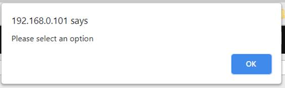</td>
  </tr>
 </table>
 <![endif]><!--[if gte vml 1]></o:wrapblock><![endif]--> 
option &amp; view”&nbsp;&nbsp;&nbsp;&nbsp;&nbsp;&nbsp;&nbsp;&nbsp;&nbsp;&nbsp;&nbsp;&nbsp;&nbsp;&nbsp;&nbsp;&nbsp;&nbsp;&nbsp;&nbsp;&nbsp;&nbsp;&nbsp;&nbsp;&nbsp;&nbsp;&nbsp;&nbsp;&nbsp;&nbsp;&nbsp;&nbsp;&nbsp;&nbsp;&nbsp; button
to get know detail. If user doesn’t select
the currency the page would alter a message (Picture1.3.2):

 

Picture1.3.2

After select the currency and click the button, user can view the
chart on top of the page(Picture1.3.3).

<!--[if gte vml 1]><o:wrapblock><v:shape id="image31.jpeg"
  o:spid="_x0000_s1069" type="#_x0000_t75" style='position:absolute;
  margin-left:86.65pt;margin-top:14.15pt;width:430.55pt;height:252pt;z-index:21;
  visibility:visible;mso-wrap-style:square;mso-wrap-distance-left:0;
  mso-wrap-distance-top:0;mso-wrap-distance-right:0;mso-wrap-distance-bottom:0;
  mso-position-horizontal:absolute;mso-position-horizontal-relative:page;
  mso-position-vertical:absolute;mso-position-vertical-relative:text'>
  <v:imagedata src="final_report.files/image061.jpg" o:title=""/>
  <w:wrap type="topAndBottom" anchorx="page"/>
 </v:shape><![endif]--><![if !vml]>
 <table cellpadding=0 cellspacing=0 align=left>
  <tr>
   <td width=116 height=0></td>
  </tr>
  <tr>
   <td></td>
   <td>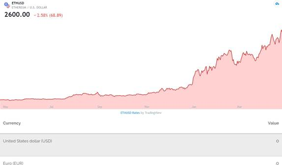</td>
  </tr>
 </table>
 <![endif]><!--[if gte vml 1]></o:wrapblock><![endif]--> 
<o:p></o:p>

<o:p>&nbsp;</o:p>

User can view
the real-time chart on this page

<!--[if gte vml 1]><o:wrapblock><v:shape
  id="image32.png" o:spid="_x0000_s1068" type="#_x0000_t75" style='position:absolute;
  left:0;text-align:left;margin-left:73.65pt;margin-top:43.2pt;width:441.35pt;
  height:129.8pt;z-index:22;visibility:visible;mso-wrap-style:square;
  mso-wrap-distance-left:0;mso-wrap-distance-top:0;mso-wrap-distance-right:0;
  mso-wrap-distance-bottom:0;mso-position-horizontal:absolute;
  mso-position-horizontal-relative:page;mso-position-vertical:absolute;
  mso-position-vertical-relative:text'>
  <v:imagedata src="final_report.files/image063.png" o:title=""/>
  <w:wrap type="topAndBottom" anchorx="page"/>
 </v:shape><![endif]--><![if !vml]>
 <table cellpadding=0 cellspacing=0>
  <tr>
   <td width=98 height=0></td>
  </tr>
  <tr>
   <td></td>
   <td>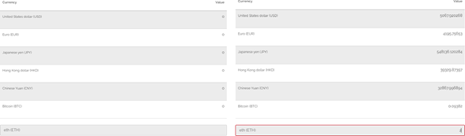</td>
  </tr>
 </table>
 <![endif]><!--[if gte vml 1]></o:wrapblock><![endif]--> 
User also can enter the value in bottom of the table to get
the Currency converter.( Picture 3.1.4) (Picture 3.1.5).

(Picture3.1.4)&nbsp;&nbsp;&nbsp;&nbsp;&nbsp;&nbsp;&nbsp;&nbsp;&nbsp;&nbsp;&nbsp;&nbsp;&nbsp;&nbsp;&nbsp;&nbsp;&nbsp;&nbsp;&nbsp;&nbsp;&nbsp;&nbsp;&nbsp;&nbsp;&nbsp; (Picture
3.1.5):user enter the number in bottom row The top of the page, There are four button(Picture1.3.6) , user can click it to access
different webpage.<o:p></o:p>

 

<o:p>&nbsp;</o:p>

<!--[if gte vml 1]><v:shape
 id="image33.jpeg" o:spid="_x0000_i1056" type="#_x0000_t75" style='width:213.75pt;
 height:83.25pt;visibility:visible;mso-wrap-style:square'>
 <v:imagedata src="final_report.files/image065.jpg" o:title=""/>
</v:shape><![endif]--><![if !vml]><![endif]><o:p></o:p>

Picture1.3.6

<!--[if gte vml 1]><v:shape id="image34.png"
 o:spid="_x0000_s1067" type="#_x0000_t75" style='position:absolute;left:0;
 text-align:left;margin-left:78pt;margin-top:23.35pt;width:28.45pt;height:25.15pt;
 z-index:1576;visibility:visible;mso-wrap-style:square;
 mso-wrap-distance-left:0;mso-wrap-distance-top:0;mso-wrap-distance-right:0;
 mso-wrap-distance-bottom:0;mso-position-horizontal:absolute;
 mso-position-horizontal-relative:page;mso-position-vertical:absolute;
 mso-position-vertical-relative:text'>
 <v:imagedata src="final_report.files/image066.png" o:title=""/>
 <w:wrap anchorx="page"/>
</v:shape><![endif]--><![if !vml]><![endif]>Different button would
direct user access different page, Such as

<o:p>&nbsp;</o:p>

this button
would logout the account and direct user to Welcome page,

<!--[if gte vml 1]><v:shape
 id="image35.png" o:spid="_x0000_i1055" type="#_x0000_t75" style='width:34.5pt;
 height:27pt;visibility:visible;mso-wrap-style:square'>
 <v:imagedata src="final_report.files/image068.png" o:title=""/>
</v:shape><![endif]--><![if !vml]><![endif]>&nbsp; &nbsp;this button would direct user to option page, user can select their style
of the Currency converter table.

<!--[if gte vml 1]><v:shape id="image36.png"
 o:spid="_x0000_i1054" type="#_x0000_t75" style='width:22.5pt;height:21pt;
 visibility:visible;mso-wrap-style:square'>
 <v:imagedata src="final_report.files/image070.png" o:title=""/>
</v:shape><![endif]--><![if !vml]><![endif]>this button would direct user to record page, user can view the record from this page. <!--[if gte vml 1]><v:shape
 id="image37.png" o:spid="_x0000_i1053" type="#_x0000_t75" style='width:18.75pt;
 height:21.75pt;visibility:visible;mso-wrap-style:square'>
 <v:imagedata src="final_report.files/image072.png" o:title=""/>
</v:shape><![endif]--><![if !vml]><![endif]>&nbsp;&nbsp;this button
would direct user to web information page, it is same with Welcome page.

 

<o:p>&nbsp;</o:p>

<o:p>&nbsp;</o:p>

<h2 style='margin-left:95.6pt;text-indent:-35.6pt;mso-list:l1 level2 lfo2;
tab-stops:95.65pt'><![if !supportLists]>1.4&nbsp;&nbsp;&nbsp;&nbsp;
<![endif]>Option Page</h2>

<!--[if gte vml 1]><o:wrapblock><v:shape
  id="image38.png" o:spid="_x0000_s1066" type="#_x0000_t75" style='position:absolute;
  left:0;text-align:left;margin-left:1in;margin-top:31.2pt;width:284.85pt;
  height:249.05pt;z-index:24;visibility:visible;mso-wrap-style:square;
  mso-wrap-distance-left:0;mso-wrap-distance-top:0;mso-wrap-distance-right:0;
  mso-wrap-distance-bottom:0;mso-position-horizontal:absolute;
  mso-position-horizontal-relative:page;mso-position-vertical:absolute;
  mso-position-vertical-relative:text'>
  <v:imagedata src="final_report.files/image074.png" o:title=""/>
  <w:wrap type="topAndBottom" anchorx="page"/>
 </v:shape><![endif]--><![if !vml]>
 <table cellpadding=0 cellspacing=0>
  <tr>
   <td width=96 height=0></td>
  </tr>
  <tr>
   <td></td>
   <td></td>
  </tr>
 </table>
 <![endif]><!--[if gte vml 1]></o:wrapblock><![endif]--> 
User in this page can verify the default option in table in
user page.

In this page user
can select element from right side and drag it to Your option to replace the
default elements(Picture1.4.1).

<!--[if gte vml 1]><v:shape
 id="_x0000_i1052" type="#_x0000_t75" style='width:451.5pt;height:81.75pt;
 visibility:visible;mso-wrap-style:square'>
 <v:imagedata src="final_report.files/image076.jpg" o:title=""/>
</v:shape><![endif]--><![if !vml]><![endif]><o:p></o:p>

Picture1.4.1

After user custom the option setting ,user can click the “Apply
&amp; Exit “ Button to applicate the setting.

<o:p>&nbsp;</o:p>

If user want
to reset option, user can click the “Reset ”Button.

 

<o:p>&nbsp;</o:p>

<h2 style='margin-left:95.75pt;text-indent:-35.75pt;mso-list:l1 level2 lfo2;
tab-stops:95.8pt'><![if !supportLists]>1.5&nbsp;&nbsp;&nbsp;&nbsp;
<![endif]>Record Page</h2>

User in this page can view the research history, the table would
show display value, currency and time. Value is
displaying the amount of value user searched, the currency is the type of
currency user searched, Time is when search the currency.

<!--[if gte vml 1]><o:wrapblock><v:shape id="image40.png"
  o:spid="_x0000_s1065" type="#_x0000_t75" style='position:absolute;
  margin-left:86.15pt;margin-top:16pt;width:297pt;height:231.5pt;z-index:25;
  visibility:visible;mso-wrap-style:square;mso-wrap-distance-left:0;
  mso-wrap-distance-top:0;mso-wrap-distance-right:0;mso-wrap-distance-bottom:0;
  mso-position-horizontal:absolute;mso-position-horizontal-relative:page;
  mso-position-vertical:absolute;mso-position-vertical-relative:text'>
  <v:imagedata src="final_report.files/image078.png" o:title=""/>
  <w:wrap type="topAndBottom" anchorx="page"/>
 </v:shape><![endif]--><![if !vml]>
 <table cellpadding=0 cellspacing=0 align=left>
  <tr>
   <td width=115 height=0></td>
  </tr>
  <tr>
   <td></td>
   <td>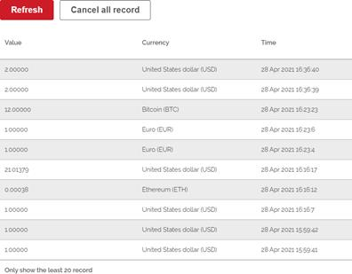</td>
  </tr>
 </table>
 <![endif]><!--[if gte vml 1]></o:wrapblock><![endif]--> 
<o:p></o:p>

<o:p>&nbsp;</o:p>

<o:p>&nbsp;</o:p>

<!--[if gte vml 1]><v:shape
 id="image41.png" o:spid="_x0000_s1064" type="#_x0000_t75" style='position:absolute;
 left:0;text-align:left;margin-left:213.75pt;margin-top:-9.2pt;width:46.65pt;
 height:19.35pt;z-index:-1879074249;visibility:visible;mso-wrap-style:square;
 mso-wrap-distance-left:0;mso-wrap-distance-top:0;mso-wrap-distance-right:0;
 mso-wrap-distance-bottom:0;mso-position-horizontal:absolute;
 mso-position-horizontal-relative:page;mso-position-vertical:absolute;
 mso-position-vertical-relative:text'>
 <v:imagedata src="final_report.files/image080.png" o:title=""/>
 <w:wrap anchorx="page"/>
</v:shape><![endif]--><![if !vml]><![endif]>User can click the “Refresh”&nbsp;&nbsp;&nbsp;&nbsp;&nbsp;&nbsp;&nbsp;&nbsp;&nbsp;&nbsp;&nbsp;&nbsp;&nbsp;&nbsp;&nbsp;&nbsp;&nbsp;&nbsp;&nbsp; button
to refresh the record on the table

<o:p>&nbsp;</o:p>

<!--[if gte vml 1]><v:shape
 id="image42.png" o:spid="_x0000_s1063" type="#_x0000_t75" style='position:absolute;
 left:0;text-align:left;margin-left:416.2pt;margin-top:-7.6pt;width:68.9pt;
 height:17.45pt;z-index:-1879074225;visibility:visible;mso-wrap-style:square;
 mso-wrap-distance-left:0;mso-wrap-distance-top:0;mso-wrap-distance-right:0;
 mso-wrap-distance-bottom:0;mso-position-horizontal:absolute;
 mso-position-horizontal-relative:page;mso-position-vertical:absolute;
 mso-position-vertical-relative:text'>
 <v:imagedata src="final_report.files/image082.png" o:title=""/>
 <w:wrap anchorx="page"/>
</v:shape><![endif]--><![if !vml]><![endif]>User also can delete all record on
the table by click “cancel all record”&nbsp;&nbsp;&nbsp;&nbsp;&nbsp;&nbsp;&nbsp;&nbsp;&nbsp;&nbsp;&nbsp;&nbsp;&nbsp;&nbsp;&nbsp;&nbsp;&nbsp;&nbsp;&nbsp;&nbsp;&nbsp;&nbsp;&nbsp;&nbsp; button

 

<o:p>&nbsp;</o:p>

<h1>Database</h1>

<!--[if gte vml 1]><o:wrapblock><v:shape
  id="image43.png" o:spid="_x0000_s1062" type="#_x0000_t75" style='position:absolute;
  left:0;text-align:left;margin-left:1in;margin-top:41.2pt;width:171pt;
  height:102pt;z-index:28;visibility:visible;mso-wrap-style:square;
  mso-wrap-distance-left:0;mso-wrap-distance-top:0;mso-wrap-distance-right:0;
  mso-wrap-distance-bottom:0;mso-position-horizontal:absolute;
  mso-position-horizontal-relative:page;mso-position-vertical:absolute;
  mso-position-vertical-relative:text'>
  <v:imagedata src="final_report.files/image084.png" o:title=""/>
  <w:wrap type="topAndBottom" anchorx="page"/>
 </v:shape><![endif]--><![if !vml]>
 <table cellpadding=0 cellspacing=0>
  <tr>
   <td width=96 height=0></td>
  </tr>
  <tr>
   <td></td>
   <td>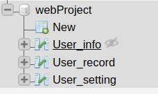</td>
  </tr>
 </table>
 <![endif]><!--[if gte vml 1]></o:wrapblock><![endif]--> 
There are three tables in database,

<![if !supportLists]>l&nbsp;&nbsp;
<![endif]>User_info table store user data, such as login_id, password, address and Unix_time and User_No.<o:p></o:p>

<!--[if gte vml 1]><o:wrapblock><v:shape
  id="image44.jpeg" o:spid="_x0000_s1061" type="#_x0000_t75" alt="一張含有 文字 的圖片  自動產生的描述"
  style='position:absolute;margin-left:98.6pt;margin-top:7.7pt;width:160.1pt;
  height:87pt;z-index:29;visibility:visible;mso-wrap-style:square;
  mso-wrap-distance-left:0;mso-wrap-distance-top:0;mso-wrap-distance-right:0;
  mso-wrap-distance-bottom:0;mso-position-horizontal:absolute;
  mso-position-horizontal-relative:page;mso-position-vertical:absolute;
  mso-position-vertical-relative:text'>
  <v:imagedata src="final_report.files/image086.jpg" o:title="一張含有 文字 的圖片  自動產生的描述"/>
  <w:wrap type="topAndBottom" anchorx="page"/>
 </v:shape><![endif]--><![if !vml]>
 <table cellpadding=0 cellspacing=0 align=left>
  <tr>
   <td width=132 height=0></td>
  </tr>
  <tr>
   <td></td>
   <td>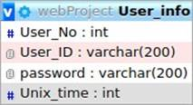</td>
  </tr>
 </table>
 <![endif]><!--[if gte vml 1]></o:wrapblock><![endif]--> 
<o:p></o:p>

<o:p>&nbsp;</o:p>

<![if !supportLists]>l&nbsp;&nbsp;
<![endif]><!--[if gte vml 1]><o:wrapblock><v:shape id="image45.jpeg"
  o:spid="_x0000_s1060" type="#_x0000_t75" alt="一張含有 文字 的圖片  自動產生的描述" style='position:absolute;
  left:0;text-align:left;margin-left:97.55pt;margin-top:57.6pt;width:157.55pt;
  height:78pt;z-index:30;visibility:visible;mso-wrap-style:square;
  mso-wrap-distance-left:0;mso-wrap-distance-top:0;mso-wrap-distance-right:0;
  mso-wrap-distance-bottom:0;mso-position-horizontal:absolute;
  mso-position-horizontal-relative:page;mso-position-vertical:absolute;
  mso-position-vertical-relative:text'>
  <v:imagedata src="final_report.files/image088.jpg" o:title="一張含有 文字 的圖片  自動產生的描述"/>
  <w:wrap type="topAndBottom" anchorx="page"/>
 </v:shape><![endif]--><![if !vml]>
 <table cellpadding=0 cellspacing=0>
  <tr>
   <td width=130 height=0></td>
  </tr>
  <tr>
   <td></td>
   <td>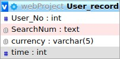</td>
  </tr>
 </table>
 <![endif]><!--[if gte vml 1]></o:wrapblock><![endif]--> 
User_record table store the research record, there are using
User_No connect with User_info table
to record user action when using the currency converter. The table are store User_No, SearchNum, currency and
time. Currency is store currency type.<o:p></o:p>

<![if !supportLists]>l&nbsp;&nbsp; <![endif]>User_setting table store the research type setting option,
there are using User_No connect with User_info table to record user action when change the display setting
in option page the table are store
User_No, First, Second, Third, Fourth, Fifth, Sixth,
Seventh. These columns are saving the sequence of option setting.<o:p></o:p>

<!--[if gte vml 1]><v:shape
 id="image46.png" o:spid="_x0000_i1051" type="#_x0000_t75" alt="一張含有 文字 的圖片  自動產生的描述"
 style='width:135pt;height:116.25pt;visibility:visible;mso-wrap-style:square'>
 <v:imagedata src="final_report.files/image089.png" o:title="一張含有 文字 的圖片  自動產生的描述"/>
</v:shape><![endif]--><![if !vml]>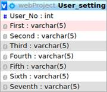<![endif]><o:p></o:p>

 

<o:p>&nbsp;</o:p>

<h1>programming languages</h1>

<o:p>&nbsp;</o:p>

<o:p>&nbsp;</o:p>

<table class=TableNormal border=1 cellspacing=0 cellpadding=0 style='margin-left:
 60.5pt;border-collapse:collapse;mso-table-layout-alt:fixed;border:none;
 mso-border-alt:solid black .5pt;mso-yfti-tbllook:480;mso-padding-alt:0cm 0cm 0cm 0cm;
 mso-border-insideh:.5pt solid black;mso-border-insidev:.5pt solid black'>
 <tr style='mso-yfti-irow:0;mso-yfti-firstrow:yes;height:125.95pt'>
  <td width=345 valign=top style='width:258.6pt;border:solid black 1.0pt;
  mso-border-alt:solid black .5pt;padding:0cm 0cm 0cm 0cm;height:125.95pt'>
  
<o:p>&nbsp;</o:p>

  
<!--[if gte vml 1]><v:shape
   id="image47.jpeg" o:spid="_x0000_i1050" type="#_x0000_t75" alt="JavaScript Interview Questions You Need To Know — Part III | by Adi S |  JavaScript in Plain English"
   style='width:246pt;height:92.25pt;visibility:visible;mso-wrap-style:square'>
   <v:imagedata src="final_report.files/image091.jpg" o:title="JavaScript Interview Questions You Need To Know — Part III | by Adi S |  JavaScript in Plain English"/>
  </v:shape><![endif]--><![if !vml]><![endif]><o:p></o:p>

  </td>
  <td width=256 valign=top style='width:192.25pt;border:solid black 1.0pt;
  border-left:none;mso-border-left-alt:solid black .5pt;mso-border-alt:solid black .5pt;
  padding:0cm 0cm 0cm 0cm;height:125.95pt'>
  
JavaScript:<o:p></o:p>

  
Use on the
  website to handle the basic function of all website
  such as generate QRcode , scan QRcode
  , count carrency , ajax change record setting and
  the setting options funcitons<o:p></o:p>

  </td>
 </tr>
 <tr style='mso-yfti-irow:1;height:108.1pt'>
  <td width=345 valign=top style='width:258.6pt;border:solid black 1.0pt;
  border-top:none;mso-border-top-alt:solid black .5pt;mso-border-alt:solid black .5pt;
  padding:0cm 0cm 0cm 0cm;height:108.1pt'>
  
<o:p>&nbsp;</o:p>

  
<!--[if gte vml 1]><v:shape
   id="image48.png" o:spid="_x0000_i1049" type="#_x0000_t75" style='width:248.25pt;
   height:92.25pt;visibility:visible;mso-wrap-style:square'>
   <v:imagedata src="final_report.files/image093.png" o:title=""/>
  </v:shape><![endif]--><![if !vml]><![endif]><o:p></o:p>

  </td>
  <td width=256 valign=top style='width:192.25pt;border-top:none;border-left:
  none;border-bottom:solid black 1.0pt;border-right:solid black 1.0pt;
  mso-border-top-alt:solid black .5pt;mso-border-left-alt:solid black .5pt;
  mso-border-alt:solid black .5pt;padding:0cm 0cm 0cm 0cm;height:108.1pt'>
  
HTML:<o:p></o:p>

  
Provide a basic design for the website.<o:p></o:p>

  </td>
 </tr>
 <tr style='mso-yfti-irow:2;height:107.95pt'>
  <td width=345 valign=top style='width:258.6pt;border:solid black 1.0pt;
  border-top:none;mso-border-top-alt:solid black .5pt;mso-border-alt:solid black .5pt;
  padding:0cm 0cm 0cm 0cm;height:107.95pt'>
  
<o:p>&nbsp;</o:p>

  
<!--[if gte vml 1]><v:shape
   id="image49.jpeg" o:spid="_x0000_i1048" type="#_x0000_t75" alt="CSS 插圖"
   style='width:246pt;height:92.25pt;visibility:visible;mso-wrap-style:square'>
   <v:imagedata src="final_report.files/image095.jpg" o:title="CSS 插圖"/>
  </v:shape><![endif]--><![if !vml]><![endif]><o:p></o:p>

  </td>
  <td width=256 valign=top style='width:192.25pt;border-top:none;border-left:
  none;border-bottom:solid black 1.0pt;border-right:solid black 1.0pt;
  mso-border-top-alt:solid black .5pt;mso-border-left-alt:solid black .5pt;
  mso-border-alt:solid black .5pt;padding:0cm 0cm 0cm 0cm;height:107.95pt'>
  
CSS:<o:p></o:p>

  
Use to handle the website design style for color,size
  or the layer of the input,button object<o:p></o:p>

  </td>
 </tr>
 <tr style='mso-yfti-irow:3;height:107.95pt'>
  <td width=345 valign=top style='width:258.6pt;border:solid black 1.0pt;
  border-top:none;mso-border-top-alt:solid black .5pt;mso-border-alt:solid black .5pt;
  padding:0cm 0cm 0cm 0cm;height:107.95pt'>
  
<o:p>&nbsp;</o:p>

  
<!--[if gte vml 1]><v:shape
   id="image50.jpeg" o:spid="_x0000_i1047" type="#_x0000_t75" alt="PHP 插圖"
   style='width:246pt;height:92.25pt;visibility:visible;mso-wrap-style:square'>
   <v:imagedata src="final_report.files/image097.jpg" o:title="PHP 插圖"/>
  </v:shape><![endif]--><![if !vml]><![endif]><o:p></o:p>

  </td>
  <td width=256 valign=top style='width:192.25pt;border-top:none;border-left:
  none;border-bottom:solid black 1.0pt;border-right:solid black 1.0pt;
  mso-border-top-alt:solid black .5pt;mso-border-left-alt:solid black .5pt;
  mso-border-alt:solid black .5pt;padding:0cm 0cm 0cm 0cm;height:107.95pt'>
  
PHP:<o:p></o:p>

  
Use to
  handle the login, update data,
  delete data and handle the api more easily to access<o:p></o:p>

  </td>
 </tr>
 <tr style='mso-yfti-irow:4;mso-yfti-lastrow:yes;height:143.95pt'>
  <td width=345 valign=top style='width:258.6pt;border:solid black 1.0pt;
  border-top:none;mso-border-top-alt:solid black .5pt;mso-border-alt:solid black .5pt;
  padding:0cm 0cm 0cm 0cm;height:143.95pt'>
  
<o:p>&nbsp;</o:p>

  
<!--[if gte vml 1]><v:shape
   id="image51.png" o:spid="_x0000_i1046" type="#_x0000_t75" style='width:245.25pt;
   height:126.75pt;visibility:visible;mso-wrap-style:square'>
   <v:imagedata src="final_report.files/image099.png" o:title=""/>
  </v:shape><![endif]--><![if !vml]><![endif]><o:p></o:p>

  </td>
  <td width=256 valign=top style='width:192.25pt;border-top:none;border-left:
  none;border-bottom:solid black 1.0pt;border-right:solid black 1.0pt;
  mso-border-top-alt:solid black .5pt;mso-border-left-alt:solid black .5pt;
  mso-border-alt:solid black .5pt;padding:0cm 0cm 0cm 0cm;height:143.95pt'>
  
MYSQL:<o:p></o:p>

  
Provide a SQL server to save all usering
  info, record and the settings,<o:p></o:p>

  </td>
 </tr>
</table>

 

<o:p>&nbsp;</o:p>

<h1>tools
used</h1>

<o:p>&nbsp;</o:p>

<o:p>&nbsp;</o:p>

<table class=TableNormal border=1 cellspacing=0 cellpadding=0 style='margin-left:
 60.5pt;border-collapse:collapse;mso-table-layout-alt:fixed;border:none;
 mso-border-alt:solid black .5pt;mso-yfti-tbllook:480;mso-padding-alt:0cm 0cm 0cm 0cm;
 mso-border-insideh:.5pt solid black;mso-border-insidev:.5pt solid black'>
 <tr style='mso-yfti-irow:0;mso-yfti-firstrow:yes;height:17.95pt'>
  <td width=601 valign=top style='width:450.85pt;border:solid black 1.0pt;
  mso-border-alt:solid black .5pt;padding:0cm 0cm 0cm 0cm;height:17.95pt'>
  
Website tools<o:p></o:p>

  </td>
 </tr>
 <tr style='mso-yfti-irow:1;height:72.1pt'>
  <td width=601 valign=top style='width:450.85pt;border:solid black 1.0pt;
  border-top:none;mso-border-top-alt:solid black .5pt;mso-border-alt:solid black .5pt;
  padding:0cm 0cm 0cm 0cm;height:72.1pt'>
  
qrcode.js<o:p></o:p>

  
Used to generate the QR code for the website for the user scan it and
  access to the website or the record conveniently<o:p></o:p>

  
<a href="https://davidshimjs.github.io/qrcodejs/">https://davidshimjs.github.io/qrcodejs/</a><o:p></o:p>

  </td>
 </tr>
 <tr style='mso-yfti-irow:2;height:53.95pt'>
  <td width=601 valign=top style='width:450.85pt;border:solid black 1.0pt;
  border-top:none;mso-border-top-alt:solid black .5pt;mso-border-alt:solid black .5pt;
  padding:0cm 0cm 0cm 0cm;height:53.95pt'>
  
currency-api<o:p></o:p>

  
Used to get the
  currency list and the price of the currency <a
  href="https://github.com/fawazahmed0/currency-api">https://github.com/fawazahmed0/currency-api</a><o:p></o:p>

  </td>
 </tr>
 <tr style='mso-yfti-irow:3;height:53.95pt'>
  <td width=601 valign=top style='width:450.85pt;border:solid black 1.0pt;
  border-top:none;mso-border-top-alt:solid black .5pt;mso-border-alt:solid black .5pt;
  padding:0cm 0cm 0cm 0cm;height:53.95pt'>
  
google ReCAPTCHA<o:p></o:p>

  
Used to
  authenticate the user login or create account is not a bot. <a href="https://www.google.com/recaptcha/about/">https://www.google.com/recaptcha/about/</a><o:p></o:p>

  </td>
 </tr>
 <tr style='mso-yfti-irow:4;height:53.95pt'>
  <td width=601 valign=top style='width:450.85pt;border:solid black 1.0pt;
  border-top:none;mso-border-top-alt:solid black .5pt;mso-border-alt:solid black .5pt;
  padding:0cm 0cm 0cm 0cm;height:53.95pt'>
  
QR code scanner<o:p></o:p>

  
Scan the QRcode from the camera <a
  href="https://github.com/jbialobr/JsQRScanner">https://github.com/jbialobr/JsQRScanner</a><o:p></o:p>

  </td>
 </tr>
 <tr style='mso-yfti-irow:5;height:53.95pt'>
  <td width=601 valign=top style='width:450.85pt;border:solid black 1.0pt;
  border-top:none;mso-border-top-alt:solid black .5pt;mso-border-alt:solid black .5pt;
  padding:0cm 0cm 0cm 0cm;height:53.95pt'>
  
TradingView Mini Chart Widget<o:p></o:p>

  
To generate the
  Chart for the website <a
  href="https://www.tradingview.com/widget/mini-chart/">https://www.tradingview.com/widget/mini-chart/</a><o:p></o:p>

  </td>
 </tr>
 <tr style='mso-yfti-irow:6;mso-yfti-lastrow:yes;height:72.1pt'>
  <td width=601 valign=top style='width:450.85pt;border:solid black 1.0pt;
  border-top:none;mso-border-top-alt:solid black .5pt;mso-border-alt:solid black .5pt;
  padding:0cm 0cm 0cm 0cm;height:72.1pt'>
  
HTML + CSS<o:p></o:p>

  
Website template<o:p></o:p>

  
A design for the website<o:p></o:p>

  
<a
  href="https://www.bypeople.com/industrious-business-html5-responsive-template/">https://www.bypeople.com/industrious-business-html5-responsive-template/</a><o:p></o:p>

  </td>
 </tr>
</table>

<o:p>&nbsp;</o:p>

<table class=TableNormal border=1 cellspacing=0 cellpadding=0 style='margin-left:
 60.5pt;border-collapse:collapse;mso-table-layout-alt:fixed;border:none;
 mso-border-alt:solid black .5pt;mso-yfti-tbllook:480;mso-padding-alt:0cm 0cm 0cm 0cm;
 mso-border-insideh:.5pt solid black;mso-border-insidev:.5pt solid black'>
 <tr style='mso-yfti-irow:0;mso-yfti-firstrow:yes;height:17.95pt'>
  <td width=553 valign=top style='width:414.85pt;border:solid black 1.0pt;
  mso-border-alt:solid black .5pt;padding:0cm 0cm 0cm 0cm;height:17.95pt'>
  
Develop tools:<o:p></o:p>

  </td>
 </tr>
 <tr style='mso-yfti-irow:1;height:35.95pt'>
  <td width=553 valign=top style='width:414.85pt;border:solid black 1.0pt;
  border-top:none;mso-border-top-alt:solid black .5pt;mso-border-alt:solid black .5pt;
  padding:0cm 0cm 0cm 0cm;height:35.95pt'>
  
Chrome(Developer
  Tools)<o:p></o:p>

  
<a
  href="https://www.google.com/intl/zh-HK/chrome/">https://www.google.com/intl/zh-HK/chrome/</a><o:p></o:p>

  </td>
 </tr>
 <tr style='mso-yfti-irow:2;height:35.95pt'>
  <td width=553 valign=top style='width:414.85pt;border:solid black 1.0pt;
  border-top:none;mso-border-top-alt:solid black .5pt;mso-border-alt:solid black .5pt;
  padding:0cm 0cm 0cm 0cm;height:35.95pt'>
  
phpMyAdmin<o:p></o:p>

  
<a
  href="https://www.phpmyadmin.net/">https://www.phpmyadmin.net/</a><o:p></o:p>

  </td>
 </tr>
 <tr style='mso-yfti-irow:3;height:35.95pt'>
  <td width=553 valign=top style='width:414.85pt;border:solid black 1.0pt;
  border-top:none;mso-border-top-alt:solid black .5pt;mso-border-alt:solid black .5pt;
  padding:0cm 0cm 0cm 0cm;height:35.95pt'>
  
Adobe Brackets (+
  beautify extenuation)<o:p></o:p>

  
<a
  href="http://brackets.io/">http://brackets.io/</a><o:p></o:p>

  </td>
 </tr>
 <tr style='mso-yfti-irow:4;mso-yfti-lastrow:yes;height:36.05pt'>
  <td width=553 valign=top style='width:414.85pt;border:solid black 1.0pt;
  border-top:none;mso-border-top-alt:solid black .5pt;mso-border-alt:solid black .5pt;
  padding:0cm 0cm 0cm 0cm;height:36.05pt'>
  
Beautify
  Extenuation(Formatting php, html, JavaScript, CSS)<o:p></o:p>

  
<a
  href="https://github.com/brackets-beautify/brackets-beautify">https://github.com/brackets-beautify/brackets-beautify</a><o:p></o:p>

  </td>
 </tr>
</table>

 

<!--[if gte vml 1]><v:shape id="image52.png" o:spid="_x0000_s1059"
 type="#_x0000_t75" style='position:absolute;margin-left:207.8pt;margin-top:671pt;
 width:86.25pt;height:42pt;z-index:-1879074129;visibility:visible;
 mso-wrap-style:square;mso-wrap-distance-left:0;mso-wrap-distance-top:0;
 mso-wrap-distance-right:0;mso-wrap-distance-bottom:0;
 mso-position-horizontal:absolute;mso-position-horizontal-relative:page;
 mso-position-vertical:absolute;mso-position-vertical-relative:page'>
 <v:imagedata src="final_report.files/image101.gif" o:title=""/>
 <w:wrap anchorx="page" anchory="page"/>
</v:shape><![endif]--><![if !vml]><![endif]><o:p></o:p>

<o:p>&nbsp;</o:p>

<o:p>&nbsp;</o:p>

<h1 style='line-height:31.55pt;mso-line-height-rule:exactly'>testing strategies and results</h1>

the testing strategies and results would include welcome page
,login/register page ,user page, modify option page ,detail page and record
page

<h2 style='margin-top:10.6pt'>welcome page</h2>

<o:p>&nbsp;</o:p>

<table class=TableNormal border=1 cellspacing=0 cellpadding=0 style='margin-left:
 60.5pt;border-collapse:collapse;mso-table-layout-alt:fixed;border:none;
 mso-border-alt:solid black .5pt;mso-yfti-tbllook:480;mso-padding-alt:0cm 0cm 0cm 0cm;
 mso-border-insideh:.5pt solid black;mso-border-insidev:.5pt solid black'>
 <tr style='mso-yfti-irow:0;mso-yfti-firstrow:yes;height:17.95pt'>
  <td width=330 valign=top style='width:247.8pt;border:solid black 1.0pt;
  mso-border-alt:solid black .5pt;padding:0cm 0cm 0cm 0cm;height:17.95pt'>
  
Use case/action<o:p></o:p>

  </td>
  <td width=271 valign=top style='width:203.05pt;border:solid black 1.0pt;
  border-left:none;mso-border-left-alt:solid black .5pt;mso-border-alt:solid black .5pt;
  padding:0cm 0cm 0cm 0cm;height:17.95pt'>
  
output<o:p></o:p>

  </td>
 </tr>
 <tr style='mso-yfti-irow:1;height:72.1pt'>
  <td width=330 valign=top style='width:247.8pt;border:solid black 1.0pt;
  border-top:none;mso-border-top-alt:solid black .5pt;mso-border-alt:solid black .5pt;
  padding:0cm 0cm 0cm 0cm;height:72.1pt'>
  
If user enter the value in
  USD row<o:p></o:p>

  </td>
  <td width=271 valign=top style='width:203.05pt;border-top:none;border-left:
  none;border-bottom:solid black 1.0pt;border-right:solid black 1.0pt;
  mso-border-top-alt:solid black .5pt;mso-border-left-alt:solid black .5pt;
  mso-border-alt:solid black .5pt;padding:0cm 0cm 0cm 0cm;height:72.1pt'>
  
The red button would
  change to<o:p></o:p>

  
<o:p>&nbsp;</o:p>

  
<!--[if gte vml 1]><v:shape
   id="image53.png" o:spid="_x0000_i1045" type="#_x0000_t75" style='width:155.25pt;
   height:30pt;visibility:visible;mso-wrap-style:square'>
   <v:imagedata src="final_report.files/image102.png" o:title=""/>
  </v:shape><![endif]--><![if !vml]><![endif]><o:p></o:p>

  
<o:p>&nbsp;</o:p>

  </td>
 </tr>
 <tr style='mso-yfti-irow:2;height:71.95pt'>
  <td width=330 valign=top style='width:247.8pt;border:solid black 1.0pt;
  border-top:none;mso-border-top-alt:solid black .5pt;mso-border-alt:solid black .5pt;
  padding:0cm 0cm 0cm 0cm;height:71.95pt'>
  
If user enter the value in EUR row<o:p></o:p>

  </td>
  <td width=271 valign=top style='width:203.05pt;border-top:none;border-left:
  none;border-bottom:solid black 1.0pt;border-right:solid black 1.0pt;
  mso-border-top-alt:solid black .5pt;mso-border-left-alt:solid black .5pt;
  mso-border-alt:solid black .5pt;padding:0cm 0cm 0cm 0cm;height:71.95pt'>
  
The red button would change to<o:p></o:p>

  
<o:p>&nbsp;</o:p>

  
<!--[if gte vml 1]><v:shape
   id="image54.png" o:spid="_x0000_i1044" type="#_x0000_t75" style='width:183.75pt;
   height:36pt;visibility:visible;mso-wrap-style:square'>
   <v:imagedata src="final_report.files/image104.png" o:title=""/>
  </v:shape><![endif]--><![if !vml]><![endif]><o:p></o:p>

  
<o:p>&nbsp;</o:p>

  </td>
 </tr>
 <tr style='mso-yfti-irow:3;height:71.95pt'>
  <td width=330 valign=top style='width:247.8pt;border:solid black 1.0pt;
  border-top:none;mso-border-top-alt:solid black .5pt;mso-border-alt:solid black .5pt;
  padding:0cm 0cm 0cm 0cm;height:71.95pt'>
  
If user enter the value in JPY row<o:p></o:p>

  </td>
  <td width=271 valign=top style='width:203.05pt;border-top:none;border-left:
  none;border-bottom:solid black 1.0pt;border-right:solid black 1.0pt;
  mso-border-top-alt:solid black .5pt;mso-border-left-alt:solid black .5pt;
  mso-border-alt:solid black .5pt;padding:0cm 0cm 0cm 0cm;height:71.95pt'>
  
The red button would change to<o:p></o:p>

  
<o:p>&nbsp;</o:p>

  
<!--[if gte vml 1]><v:shape
   id="image55.png" o:spid="_x0000_i1043" type="#_x0000_t75" style='width:188.25pt;
   height:37.5pt;visibility:visible;mso-wrap-style:square'>
   <v:imagedata src="final_report.files/image106.png" o:title=""/>
  </v:shape><![endif]--><![if !vml]><![endif]><o:p></o:p>

  
<o:p>&nbsp;</o:p>

  </td>
 </tr>
 <tr style='mso-yfti-irow:4;height:71.95pt'>
  <td width=330 valign=top style='width:247.8pt;border:solid black 1.0pt;
  border-top:none;mso-border-top-alt:solid black .5pt;mso-border-alt:solid black .5pt;
  padding:0cm 0cm 0cm 0cm;height:71.95pt'>
  
If user enter the value in HKD row<o:p></o:p>

  </td>
  <td width=271 valign=top style='width:203.05pt;border-top:none;border-left:
  none;border-bottom:solid black 1.0pt;border-right:solid black 1.0pt;
  mso-border-top-alt:solid black .5pt;mso-border-left-alt:solid black .5pt;
  mso-border-alt:solid black .5pt;padding:0cm 0cm 0cm 0cm;height:71.95pt'>
  
The red button would change to<o:p></o:p>

  
<o:p>&nbsp;</o:p>

  
<!--[if gte vml 1]><v:shape
   id="image56.png" o:spid="_x0000_i1042" type="#_x0000_t75" style='width:192.75pt;
   height:37.5pt;visibility:visible;mso-wrap-style:square'>
   <v:imagedata src="final_report.files/image108.png" o:title=""/>
  </v:shape><![endif]--><![if !vml]><![endif]><o:p></o:p>

  
<o:p>&nbsp;</o:p>

  </td>
 </tr>
 <tr style='mso-yfti-irow:5;height:71.95pt'>
  <td width=330 valign=top style='width:247.8pt;border:solid black 1.0pt;
  border-top:none;mso-border-top-alt:solid black .5pt;mso-border-alt:solid black .5pt;
  padding:0cm 0cm 0cm 0cm;height:71.95pt'>
  
If user enter the value in CNY row<o:p></o:p>

  </td>
  <td width=271 valign=top style='width:203.05pt;border-top:none;border-left:
  none;border-bottom:solid black 1.0pt;border-right:solid black 1.0pt;
  mso-border-top-alt:solid black .5pt;mso-border-left-alt:solid black .5pt;
  mso-border-alt:solid black .5pt;padding:0cm 0cm 0cm 0cm;height:71.95pt'>
  
The red button would change to<o:p></o:p>

  
<o:p>&nbsp;</o:p>

  
<!--[if gte vml 1]><v:shape
   id="image57.png" o:spid="_x0000_i1041" type="#_x0000_t75" style='width:190.5pt;
   height:37.5pt;visibility:visible;mso-wrap-style:square'>
   <v:imagedata src="final_report.files/image110.png" o:title=""/>
  </v:shape><![endif]--><![if !vml]><![endif]><o:p></o:p>

  </td>
 </tr>
 <tr style='mso-yfti-irow:6;height:71.95pt'>
  <td width=330 valign=top style='width:247.8pt;border:solid black 1.0pt;
  border-top:none;mso-border-top-alt:solid black .5pt;mso-border-alt:solid black .5pt;
  padding:0cm 0cm 0cm 0cm;height:71.95pt'>
  
<o:p>&nbsp;</o:p>

  
<o:p>&nbsp;</o:p>

  
<o:p>&nbsp;</o:p>

  
If user click reset button<o:p></o:p>

  </td>
  <td width=271 valign=top style='width:203.05pt;border-top:none;border-left:
  none;border-bottom:solid black 1.0pt;border-right:solid black 1.0pt;
  mso-border-top-alt:solid black .5pt;mso-border-left-alt:solid black .5pt;
  mso-border-alt:solid black .5pt;padding:0cm 0cm 0cm 0cm;height:71.95pt'>
  
Reset all the input in the table<o:p></o:p>

  </td>
 </tr>
 <tr style='mso-yfti-irow:7;mso-yfti-lastrow:yes;height:36.05pt'>
  <td width=330 valign=top style='width:247.8pt;border:solid black 1.0pt;
  border-top:none;mso-border-top-alt:solid black .5pt;mso-border-alt:solid black .5pt;
  padding:0cm 0cm 0cm 0cm;height:36.05pt'>
  
If user click generate QRcode to share button<o:p></o:p>

  </td>
  <td width=271 valign=top style='width:203.05pt;border-top:none;border-left:
  none;border-bottom:solid black 1.0pt;border-right:solid black 1.0pt;
  mso-border-top-alt:solid black .5pt;mso-border-left-alt:solid black .5pt;
  mso-border-alt:solid black .5pt;padding:0cm 0cm 0cm 0cm;height:36.05pt'>
  
QR would save the search
  value and<o:p></o:p>

  
make it to be QR code.<o:p></o:p>

  </td>
 </tr>
</table>

 

<!--[if mso & !supportInlineShapes & supportFields]>&nbsp;SHAPE &nbsp;\* MERGEFORMAT <![endif]--><!--[if gte vml 1]><v:group
 id="_x0000_s1026" style='width:451.35pt;height:55.1pt;
 mso-position-horizontal-relative:char;mso-position-vertical-relative:line'
 coordsize="9027,1102">
 <v:line id="_x0000_s1034" style='position:absolute' from="10,5" to="4956,5"
  strokeweight=".48pt"/>
 <v:line id="_x0000_s1033" style='position:absolute' from="4966,5" to="9017,5"
  strokeweight=".48pt"/>
 <v:line id="_x0000_s1032" style='position:absolute' from="5,0" to="5,1102"
  strokeweight=".48pt"/>
 <v:line id="_x0000_s1031" style='position:absolute' from="10,1097" to="4956,1097"
  strokeweight=".48pt"/>
 <v:line id="_x0000_s1030" style='position:absolute' from="4961,0" to="4961,1102"
  strokeweight=".16969mm"/>
 <v:line id="_x0000_s1029" style='position:absolute' from="4966,1097" to="9017,1097"
  strokeweight=".48pt"/>
 <v:line id="_x0000_s1028" style='position:absolute' from="9022,0" to="9022,1102"
  strokeweight=".16969mm"/>
 <v:shape id="_x0000_s1027" type="#_x0000_t75" style='position:absolute;left:187;
  top:115;width:4664;height:855'>
  <v:imagedata src="final_report.files/image112.png" o:title=""/>
 </v:shape><w:anchorlock/>
</v:group><![endif]--><![if !vml]><![endif]><!--[if mso & !supportInlineShapes & supportFields]><v:shape id="_x0000_i1025"
 type="#_x0000_t75" style='width:631.85pt;height:77.1pt'>
 <v:imagedata croptop="-65520f" cropbottom="65520f"/>
</v:shape><![endif]--><o:p></o:p>

<o:p>&nbsp;</o:p>

<h2>In login/register page</h2>

There are number of cases would happen:

<table class=TableNormal border=1 cellspacing=0 cellpadding=0 style='margin-left:
 60.5pt;border-collapse:collapse;mso-table-layout-alt:fixed;border:none;
 mso-border-alt:solid black .5pt;mso-yfti-tbllook:480;mso-padding-alt:0cm 0cm 0cm 0cm;
 mso-border-insideh:.5pt solid black;mso-border-insidev:.5pt solid black'>
 <tr style='mso-yfti-irow:0;mso-yfti-firstrow:yes;height:17.95pt'>
  <td width=274 valign=top style='width:205.3pt;border:solid black 1.0pt;
  mso-border-alt:solid black .5pt;padding:0cm 0cm 0cm 0cm;height:17.95pt'>
  
Use case/action<o:p></o:p>

  </td>
  <td width=331 valign=top style='width:248.0pt;border:solid black 1.0pt;
  border-left:none;mso-border-left-alt:solid black .5pt;mso-border-alt:solid black .5pt;
  padding:0cm 0cm 0cm 0cm;height:17.95pt'>
  
output<o:p></o:p>

  </td>
 </tr>
 <tr style='mso-yfti-irow:1;height:107.95pt'>
  <td width=274 valign=top style='width:205.3pt;border:solid black 1.0pt;
  border-top:none;mso-border-top-alt:solid black .5pt;mso-border-alt:solid black .5pt;
  padding:0cm 0cm 0cm 0cm;height:107.95pt'>
  
If user success create a new account<o:p></o:p>

  </td>
  <td width=331 valign=top style='width:248.0pt;border-top:none;border-left:
  none;border-bottom:solid black 1.0pt;border-right:solid black 1.0pt;
  mso-border-top-alt:solid black .5pt;mso-border-left-alt:solid black .5pt;
  mso-border-alt:solid black .5pt;padding:0cm 0cm 0cm 0cm;height:107.95pt'>
  
<o:p>&nbsp;</o:p>

  
<!--[if gte vml 1]><v:shape
   id="image24.png" o:spid="_x0000_i1040" type="#_x0000_t75" style='width:209.25pt;
   height:60.75pt;visibility:visible;mso-wrap-style:square'>
   <v:imagedata src="final_report.files/image047.png" o:title=""/>
  </v:shape><![endif]--><![if !vml]>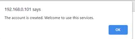<![endif]><o:p></o:p>

  
The webpage
  would direit to user page and alert a success login
  message.<o:p></o:p>

  </td>
 </tr>
 <tr style='mso-yfti-irow:2;height:125.95pt'>
  <td width=274 valign=top style='width:205.3pt;border:solid black 1.0pt;
  border-top:none;mso-border-top-alt:solid black .5pt;mso-border-alt:solid black .5pt;
  padding:0cm 0cm 0cm 0cm;height:125.95pt'>
  
If user
  does not enter the password to login or create account<o:p></o:p>

  </td>
  <td width=331 valign=top style='width:248.0pt;border-top:none;border-left:
  none;border-bottom:solid black 1.0pt;border-right:solid black 1.0pt;
  mso-border-top-alt:solid black .5pt;mso-border-left-alt:solid black .5pt;
  mso-border-alt:solid black .5pt;padding:0cm 0cm 0cm 0cm;height:125.95pt'>
  
<o:p>&nbsp;</o:p>

  
<!--[if gte vml 1]><v:shape
   id="image25.png" o:spid="_x0000_i1039" type="#_x0000_t75" style='width:217.5pt;
   height:64.5pt;visibility:visible;mso-wrap-style:square'>
   <v:imagedata src="final_report.files/image049.png" o:title=""/>
  </v:shape><![endif]--><![if !vml]><![endif]><o:p></o:p>

  
The webpage would alert a password error message.<o:p></o:p>

  </td>
 </tr>
 <tr style='mso-yfti-irow:3;mso-yfti-lastrow:yes;height:125.95pt'>
  <td width=274 valign=top style='width:205.3pt;border:solid black 1.0pt;
  border-top:none;mso-border-top-alt:solid black .5pt;mso-border-alt:solid black .5pt;
  padding:0cm 0cm 0cm 0cm;height:125.95pt'>
  
If user
  does not click the checkbox for google ReCAPTCHA<o:p></o:p>

  </td>
  <td width=331 valign=top style='width:248.0pt;border-top:none;border-left:
  none;border-bottom:solid black 1.0pt;border-right:solid black 1.0pt;
  mso-border-top-alt:solid black .5pt;mso-border-left-alt:solid black .5pt;
  mso-border-alt:solid black .5pt;padding:0cm 0cm 0cm 0cm;height:125.95pt'>
  
<o:p>&nbsp;</o:p>

  
<!--[if gte vml 1]><v:shape
   id="image26.png" o:spid="_x0000_i1038" type="#_x0000_t75" style='width:200.25pt;
   height:58.5pt;visibility:visible;mso-wrap-style:square'>
   <v:imagedata src="final_report.files/image051.png" o:title=""/>
  </v:shape><![endif]--><![if !vml]>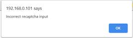<![endif]><o:p></o:p>

  
The webpage would alert a google ReCAPTCHA error message.<o:p></o:p>

  </td>
 </tr>
</table>

<o:p>&nbsp;</o:p>

<o:p>&nbsp;</o:p>

<h1 style='margin-top:8.8pt;line-height:normal'>In user page</h1>

<o:p>&nbsp;</o:p>

<o:p>&nbsp;</o:p>

<table class=TableNormal border=1 cellspacing=0 cellpadding=0 style='margin-left:
 60.5pt;border-collapse:collapse;mso-table-layout-alt:fixed;border:none;
 mso-border-alt:solid black .5pt;mso-yfti-tbllook:480;mso-padding-alt:0cm 0cm 0cm 0cm;
 mso-border-insideh:.5pt solid black;mso-border-insidev:.5pt solid black'>
 <tr style='mso-yfti-irow:0;mso-yfti-firstrow:yes;height:18.05pt'>
  <td width=286 valign=top style='width:214.8pt;border:solid black 1.0pt;
  mso-border-alt:solid black .5pt;padding:0cm 0cm 0cm 0cm;height:18.05pt'>
  
Use case/action<o:p></o:p>

  </td>
  <td width=315 valign=top style='width:236.05pt;border:solid black 1.0pt;
  border-left:none;mso-border-left-alt:solid black .5pt;mso-border-alt:solid black .5pt;
  padding:0cm 0cm 0cm 0cm;height:18.05pt'>
  
output<o:p></o:p>

  </td>
 </tr>
 <tr style='mso-yfti-irow:1;mso-yfti-lastrow:yes;height:17.95pt'>
  <td width=286 valign=top style='width:214.8pt;border:solid black 1.0pt;
  border-top:none;mso-border-top-alt:solid black .5pt;mso-border-alt:solid black .5pt;
  padding:0cm 0cm 0cm 0cm;height:17.95pt'>
  
If user enter the value in BTC row<o:p></o:p>

  </td>
  <td width=315 valign=top style='width:236.05pt;border-top:none;border-left:
  none;border-bottom:solid black 1.0pt;border-right:solid black 1.0pt;
  mso-border-top-alt:solid black .5pt;mso-border-left-alt:solid black .5pt;
  mso-border-alt:solid black .5pt;padding:0cm 0cm 0cm 0cm;height:17.95pt'>
  
The red button would change to<o:p></o:p>

  </td>
 </tr>
</table>

 

<table class=TableNormal border=1 cellspacing=0 cellpadding=0 style='margin-left:
 60.5pt;border-collapse:collapse;mso-table-layout-alt:fixed;border:none;
 mso-border-alt:solid black .5pt;mso-yfti-tbllook:480;mso-padding-alt:0cm 0cm 0cm 0cm;
 mso-border-insideh:.5pt solid black;mso-border-insidev:.5pt solid black'>
 <tr style='mso-yfti-irow:0;mso-yfti-firstrow:yes;height:53.95pt'>
  <td width=286 valign=top style='width:214.8pt;border:solid black 1.0pt;
  mso-border-alt:solid black .5pt;padding:0cm 0cm 0cm 0cm;height:53.95pt'>
  
<o:p>&nbsp;</o:p>

  </td>
  <td width=315 valign=top style='width:236.05pt;border:solid black 1.0pt;
  border-left:none;mso-border-left-alt:solid black .5pt;mso-border-alt:solid black .5pt;
  padding:0cm 0cm 0cm 0cm;height:53.95pt'>
  
<o:p>&nbsp;</o:p>

  
<!--[if gte vml 1]><v:shape
   id="image59.png" o:spid="_x0000_i1037" type="#_x0000_t75" style='width:218.25pt;
   height:42pt;visibility:visible;mso-wrap-style:square'>
   <v:imagedata src="final_report.files/image117.gif" o:title=""/>
  </v:shape><![endif]--><![if !vml]><![endif]><o:p></o:p>

  </td>
 </tr>
 <tr style='mso-yfti-irow:1;height:72.1pt'>
  <td width=286 valign=top style='width:214.8pt;border:solid black 1.0pt;
  border-top:none;mso-border-top-alt:solid black .5pt;mso-border-alt:solid black .5pt;
  padding:0cm 0cm 0cm 0cm;height:72.1pt'>
  
If user enter the value in
  ETH row<o:p></o:p>

  </td>
  <td width=315 valign=top style='width:236.05pt;border-top:none;border-left:
  none;border-bottom:solid black 1.0pt;border-right:solid black 1.0pt;
  mso-border-top-alt:solid black .5pt;mso-border-left-alt:solid black .5pt;
  mso-border-alt:solid black .5pt;padding:0cm 0cm 0cm 0cm;height:72.1pt'>
  
The red button would
  change to<o:p></o:p>

  
<o:p>&nbsp;</o:p>

  
<!--[if gte vml 1]><v:shape
   id="image60.png" o:spid="_x0000_i1036" type="#_x0000_t75" style='width:217.5pt;
   height:42pt;visibility:visible;mso-wrap-style:square'>
   <v:imagedata src="final_report.files/image118.gif" o:title=""/>
  </v:shape><![endif]--><![if !vml]><![endif]><o:p></o:p>

  </td>
 </tr>
 <tr style='mso-yfti-irow:2;height:89.95pt'>
  <td width=286 valign=top style='width:214.8pt;border:solid black 1.0pt;
  border-top:none;mso-border-top-alt:solid black .5pt;mso-border-alt:solid black .5pt;
  padding:0cm 0cm 0cm 0cm;height:89.95pt'>
  
If use clicked the Auto mode<o:p></o:p>

  
<o:p>&nbsp;</o:p>

  
<o:p>&nbsp;</o:p>

  
<!--[if gte vml 1]><v:shape
   id="image28.png" o:spid="_x0000_i1035" type="#_x0000_t75" style='width:103.5pt;
   height:25.5pt;visibility:visible;mso-wrap-style:square'>
   <v:imagedata src="final_report.files/image055.png" o:title=""/>
  </v:shape><![endif]--><![if !vml]><![endif]><o:p></o:p>

  
<o:p>&nbsp;</o:p>

  </td>
  <td width=315 valign=top style='width:236.05pt;border-top:none;border-left:
  none;border-bottom:solid black 1.0pt;border-right:solid black 1.0pt;
  mso-border-top-alt:solid black .5pt;mso-border-left-alt:solid black .5pt;
  mso-border-alt:solid black .5pt;padding:0cm 0cm 0cm 0cm;height:89.95pt'>
  
The row of formula would calculate<o:p></o:p>

  </td>
 </tr>
 <tr style='mso-yfti-irow:3;height:125.95pt'>
  <td width=286 valign=top style='width:214.8pt;border:solid black 1.0pt;
  border-top:none;mso-border-top-alt:solid black .5pt;mso-border-alt:solid black .5pt;
  padding:0cm 0cm 0cm 0cm;height:125.95pt'>
  
If user
  want to know more detail of the currency, they can select and click one of
  the choose on the table and click Select option &amp; view button<o:p></o:p>

  
<o:p>&nbsp;</o:p>

  
<!--[if gte vml 1]><v:shape
   id="image61.png" o:spid="_x0000_i1034" type="#_x0000_t75" style='width:135.75pt;
   height:30pt;visibility:visible;mso-wrap-style:square'>
   <v:imagedata src="final_report.files/image120.png" o:title=""/>
  </v:shape><![endif]--><![if !vml]><![endif]><o:p></o:p>

  
<o:p>&nbsp;</o:p>

  </td>
  <td width=315 valign=top style='width:236.05pt;border-top:none;border-left:
  none;border-bottom:solid black 1.0pt;border-right:solid black 1.0pt;
  mso-border-top-alt:solid black .5pt;mso-border-left-alt:solid black .5pt;
  mso-border-alt:solid black .5pt;padding:0cm 0cm 0cm 0cm;height:125.95pt'>
  
User can
  view the chart and column table in detail page.<o:p></o:p>

  </td>
 </tr>
 <tr style='mso-yfti-irow:4;mso-yfti-lastrow:yes;height:89.95pt'>
  <td width=286 valign=top style='width:214.8pt;border:solid black 1.0pt;
  border-top:none;mso-border-top-alt:solid black .5pt;mso-border-alt:solid black .5pt;
  padding:0cm 0cm 0cm 0cm;height:89.95pt'>
  
If user click the Select option &amp; view button, but does not select
  the row choose<o:p></o:p>

  </td>
  <td width=315 valign=top style='width:236.05pt;border-top:none;border-left:
  none;border-bottom:solid black 1.0pt;border-right:solid black 1.0pt;
  mso-border-top-alt:solid black .5pt;mso-border-left-alt:solid black .5pt;
  mso-border-alt:solid black .5pt;padding:0cm 0cm 0cm 0cm;height:89.95pt'>
  
The webpage would show the alert to user.<o:p></o:p>

  
<o:p>&nbsp;</o:p>

  
<!--[if gte vml 1]><v:shape
   id="image62.png" o:spid="_x0000_i1033" type="#_x0000_t75" style='width:219pt;
   height:48.75pt;visibility:visible;mso-wrap-style:square'>
   <v:imagedata src="final_report.files/image122.png" o:title=""/>
  </v:shape><![endif]--><![if !vml]>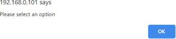<![endif]><o:p></o:p>

  
<o:p>&nbsp;</o:p>

  </td>
 </tr>
</table>

<o:p>&nbsp;</o:p>

<o:p>&nbsp;</o:p>

<h2>In
Detail Page</h2>

<o:p>&nbsp;</o:p>

<table class=TableNormal border=1 cellspacing=0 cellpadding=0 style='margin-left:
 60.5pt;border-collapse:collapse;mso-table-layout-alt:fixed;border:none;
 mso-border-alt:solid black .5pt;mso-yfti-tbllook:480;mso-padding-alt:0cm 0cm 0cm 0cm;
 mso-border-insideh:.5pt solid black;mso-border-insidev:.5pt solid black'>
 <tr style='mso-yfti-irow:0;mso-yfti-firstrow:yes;height:17.95pt'>
  <td width=347 valign=top style='width:260.5pt;border:solid black 1.0pt;
  mso-border-alt:solid black .5pt;padding:0cm 0cm 0cm 0cm;height:17.95pt'>
  
Use case/action<o:p></o:p>

  </td>
  <td width=254 valign=top style='width:190.3pt;border:solid black 1.0pt;
  border-left:none;mso-border-left-alt:solid black .5pt;mso-border-alt:solid black .5pt;
  padding:0cm 0cm 0cm 0cm;height:17.95pt'>
  
output<o:p></o:p>

  </td>
 </tr>
 <tr style='mso-yfti-irow:1;mso-yfti-lastrow:yes;height:126.05pt'>
  <td width=347 valign=top style='width:260.5pt;border:solid black 1.0pt;
  border-top:none;mso-border-top-alt:solid black .5pt;mso-border-alt:solid black .5pt;
  padding:0cm 0cm 0cm 0cm;height:126.05pt'>
  
User can insert the value
  in row<o:p></o:p>

  
<o:p>&nbsp;</o:p>

  
<!--[if gte vml 1]><v:shape id="image63.png"
   o:spid="_x0000_i1032" type="#_x0000_t75" style='width:247.5pt;height:59.25pt;
   visibility:visible;mso-wrap-style:square'>
   <v:imagedata src="final_report.files/image124.png" o:title=""/>
  </v:shape><![endif]--><![if !vml]>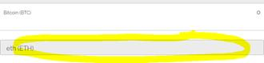<![endif]><o:p></o:p>

  
<o:p>&nbsp;</o:p>

  
<o:p>&nbsp;</o:p>

  
<o:p>&nbsp;</o:p>

  </td>
  <td width=254 valign=top style='width:190.3pt;border-top:none;border-left:
  none;border-bottom:solid black 1.0pt;border-right:solid black 1.0pt;
  mso-border-top-alt:solid black .5pt;mso-border-left-alt:solid black .5pt;
  mso-border-alt:solid black .5pt;padding:0cm 0cm 0cm 0cm;height:126.05pt'>
  
User can know the different Currency price.<o:p></o:p>

  
<!--[if gte vml 1]><v:shape
   id="image64.png" o:spid="_x0000_i1031" type="#_x0000_t75" style='width:185.25pt;
   height:79.5pt;visibility:visible;mso-wrap-style:square'>
   <v:imagedata src="final_report.files/image126.png" o:title=""/>
  </v:shape><![endif]--><![if !vml]>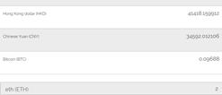<![endif]><o:p></o:p>

  </td>
 </tr>
</table>

 

<o:p>&nbsp;</o:p>

<h2>In select option Page</h2>

<o:p>&nbsp;</o:p>

<table class=TableNormal border=1 cellspacing=0 cellpadding=0 style='margin-left:
 60.5pt;border-collapse:collapse;mso-table-layout-alt:fixed;border:none;
 mso-border-alt:solid black .5pt;mso-yfti-tbllook:480;mso-padding-alt:0cm 0cm 0cm 0cm;
 mso-border-insideh:.5pt solid black;mso-border-insidev:.5pt solid black'>
 <tr style='mso-yfti-irow:0;mso-yfti-firstrow:yes;height:17.95pt'>
  <td width=300 valign=top style='width:225.35pt;border:solid black 1.0pt;
  mso-border-alt:solid black .5pt;padding:0cm 0cm 0cm 0cm;height:17.95pt'>
  
Use case/action<o:p></o:p>

  </td>
  <td width=301 valign=top style='width:225.45pt;border:solid black 1.0pt;
  border-left:none;mso-border-left-alt:solid black .5pt;mso-border-alt:solid black .5pt;
  padding:0cm 0cm 0cm 0cm;height:17.95pt'>
  
output<o:p></o:p>

  </td>
 </tr>
 <tr style='mso-yfti-irow:1;height:72.1pt'>
  <td width=300 valign=top style='width:225.35pt;border:solid black 1.0pt;
  border-top:none;mso-border-top-alt:solid black .5pt;mso-border-alt:solid black .5pt;
  padding:0cm 0cm 0cm 0cm;height:72.1pt'>
  
user can select element from right side and drag it to replace the
  default elements<o:p></o:p>

  
<!--[if gte vml 1]><v:shape
   id="image39.jpeg" o:spid="_x0000_i1030" type="#_x0000_t75" style='width:174.75pt;
   height:31.5pt;visibility:visible;mso-wrap-style:square'>
   <v:imagedata src="final_report.files/image076.jpg" o:title=""/>
  </v:shape><![endif]--><![if !vml]><![endif]><o:p></o:p>

  </td>
  <td width=301 valign=top style='width:225.45pt;border-top:none;border-left:
  none;border-bottom:solid black 1.0pt;border-right:solid black 1.0pt;
  mso-border-top-alt:solid black .5pt;mso-border-left-alt:solid black .5pt;
  mso-border-alt:solid black .5pt;padding:0cm 0cm 0cm 0cm;height:72.1pt'>
  
The default option would changed<o:p></o:p>

  </td>
 </tr>
 <tr style='mso-yfti-irow:2;height:71.95pt'>
  <td width=300 valign=top style='width:225.35pt;border:solid black 1.0pt;
  border-top:none;mso-border-top-alt:solid black .5pt;mso-border-alt:solid black .5pt;
  padding:0cm 0cm 0cm 0cm;height:71.95pt'>
  
user custom the option setting ,user can click the “Apply &amp; Exit “
  Button to applicate the setting.<o:p></o:p>

  </td>
  <td width=301 valign=top style='width:225.45pt;border-top:none;border-left:
  none;border-bottom:solid black 1.0pt;border-right:solid black 1.0pt;
  mso-border-top-alt:solid black .5pt;mso-border-left-alt:solid black .5pt;
  mso-border-alt:solid black .5pt;padding:0cm 0cm 0cm 0cm;height:71.95pt'>
  
The setting would upload to database<o:p></o:p>

  </td>
 </tr>
 <tr style='mso-yfti-irow:3;mso-yfti-lastrow:yes;height:35.95pt'>
  <td width=300 valign=top style='width:225.35pt;border:solid black 1.0pt;
  border-top:none;mso-border-top-alt:solid black .5pt;mso-border-alt:solid black .5pt;
  padding:0cm 0cm 0cm 0cm;height:35.95pt'>
  
<o:p>&nbsp;</o:p>

  
Click reset button<o:p></o:p>

  </td>
  <td width=301 valign=top style='width:225.45pt;border-top:none;border-left:
  none;border-bottom:solid black 1.0pt;border-right:solid black 1.0pt;
  mso-border-top-alt:solid black .5pt;mso-border-left-alt:solid black .5pt;
  mso-border-alt:solid black .5pt;padding:0cm 0cm 0cm 0cm;height:35.95pt'>
  
reset the current setting to be default<o:p></o:p>

  
setting<o:p></o:p>

  </td>
 </tr>
</table>

<o:p>&nbsp;</o:p>

<h2 style='margin-top:0cm'><!--[if gte vml 1]><v:shape id="image65.png" o:spid="_x0000_s1058"
 type="#_x0000_t75" style='position:absolute;left:0;text-align:left;
 margin-left:169.9pt;margin-top:-59.35pt;width:40.3pt;height:18.25pt;z-index:-1879074081;
 visibility:visible;mso-wrap-style:square;mso-wrap-distance-left:0;
 mso-wrap-distance-top:0;mso-wrap-distance-right:0;mso-wrap-distance-bottom:0;
 mso-position-horizontal:absolute;mso-position-horizontal-relative:page;
 mso-position-vertical:absolute;mso-position-vertical-relative:text'>
 <v:imagedata src="final_report.files/image129.png" o:title=""/>
 <w:wrap anchorx="page"/>
</v:shape><![endif]--><![if !vml]><![endif]>In Record
page,</h2>

<o:p>&nbsp;</o:p>

<table class=TableNormal border=1 cellspacing=0 cellpadding=0 style='margin-left:
 60.5pt;border-collapse:collapse;mso-table-layout-alt:fixed;border:none;
 mso-border-alt:solid black .5pt;mso-yfti-tbllook:480;mso-padding-alt:0cm 0cm 0cm 0cm;
 mso-border-insideh:.5pt solid black;mso-border-insidev:.5pt solid black'>
 <tr style='mso-yfti-irow:0;mso-yfti-firstrow:yes;height:17.95pt'>
  <td width=300 valign=top style='width:225.35pt;border:solid black 1.0pt;
  mso-border-alt:solid black .5pt;padding:0cm 0cm 0cm 0cm;height:17.95pt'>
  
Use case/action<o:p></o:p>

  </td>
  <td width=301 valign=top style='width:225.45pt;border:solid black 1.0pt;
  border-left:none;mso-border-left-alt:solid black .5pt;mso-border-alt:solid black .5pt;
  padding:0cm 0cm 0cm 0cm;height:17.95pt'>
  
output<o:p></o:p>

  </td>
 </tr>
 <tr style='mso-yfti-irow:1;height:107.95pt'>
  <td width=300 valign=top style='width:225.35pt;border:solid black 1.0pt;
  border-top:none;mso-border-top-alt:solid black .5pt;mso-border-alt:solid black .5pt;
  padding:0cm 0cm 0cm 0cm;height:107.95pt'>
  
User in this page would see<o:p></o:p>

  </td>
  <td width=301 valign=top style='width:225.45pt;border-top:none;border-left:
  none;border-bottom:solid black 1.0pt;border-right:solid black 1.0pt;
  mso-border-top-alt:solid black .5pt;mso-border-left-alt:solid black .5pt;
  mso-border-alt:solid black .5pt;padding:0cm 0cm 0cm 0cm;height:107.95pt'>
  
<o:p>&nbsp;</o:p>

  
<!--[if gte vml 1]><v:shape
   id="image66.png" o:spid="_x0000_i1029" type="#_x0000_t75" style='width:198pt;
   height:87.75pt;visibility:visible;mso-wrap-style:square'>
   <v:imagedata src="final_report.files/image131.png" o:title=""/>
  </v:shape><![endif]--><![if !vml]>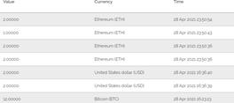<![endif]><o:p></o:p>

  </td>
 </tr>
 <tr style='mso-yfti-irow:2;height:54.05pt'>
  <td width=300 valign=top style='width:225.35pt;border:solid black 1.0pt;
  border-top:none;mso-border-top-alt:solid black .5pt;mso-border-alt:solid black .5pt;
  padding:0cm 0cm 0cm 0cm;height:54.05pt'>
  
<o:p>&nbsp;</o:p>

  
<!--[if gte vml 1]><v:shape
   id="image67.png" o:spid="_x0000_i1028" type="#_x0000_t75" style='width:93.75pt;
   height:35.25pt;visibility:visible;mso-wrap-style:square'>
   <v:imagedata src="final_report.files/image133.gif" o:title=""/>
  </v:shape><![endif]--><![if !vml]><![endif]><o:p></o:p>

  
Click
  refresh button<o:p></o:p>

  </td>
  <td width=301 valign=top style='width:225.45pt;border-top:none;border-left:
  none;border-bottom:solid black 1.0pt;border-right:solid black 1.0pt;
  mso-border-top-alt:solid black .5pt;mso-border-left-alt:solid black .5pt;
  mso-border-alt:solid black .5pt;padding:0cm 0cm 0cm 0cm;height:54.05pt'>
  
the page of data would update from database<o:p></o:p>

  </td>
 </tr>
 <tr style='mso-yfti-irow:3;mso-yfti-lastrow:yes;height:71.95pt'>
  <td width=300 valign=top style='width:225.35pt;border:solid black 1.0pt;
  border-top:none;mso-border-top-alt:solid black .5pt;mso-border-alt:solid black .5pt;
  padding:0cm 0cm 0cm 0cm;height:71.95pt'>
  
Click the cancel all record button<o:p></o:p>

  
<o:p>&nbsp;</o:p>

  
<!--[if gte vml 1]><v:shape
   id="image68.png" o:spid="_x0000_i1027" type="#_x0000_t75" style='width:159.75pt;
   height:35.25pt;visibility:visible;mso-wrap-style:square'>
   <v:imagedata src="final_report.files/image134.gif" o:title=""/>
  </v:shape><![endif]--><![if !vml]><![endif]><o:p></o:p>

  </td>
  <td width=301 valign=top style='width:225.45pt;border-top:none;border-left:
  none;border-bottom:solid black 1.0pt;border-right:solid black 1.0pt;
  mso-border-top-alt:solid black .5pt;mso-border-left-alt:solid black .5pt;
  mso-border-alt:solid black .5pt;padding:0cm 0cm 0cm 0cm;height:71.95pt'>
  
The record data would delete from database<o:p></o:p>

  </td>
 </tr>
</table>

 

<o:p>&nbsp;</o:p>

<h1>user
manual</h1>

User can view
different currency in the table.

In Welcome page
user can view the country currency convent.

After user login the page, they can view virtual currency and view
the chart in the page. Then, there are few conditions for setup the website,
such as:

<![if !supportLists]>l&nbsp;&nbsp; <![endif]>Set up LAMP/WAMP
server<o:p></o:p>

LAMP(Linux, Apache, MySQL, PHP)/ WAMP(Windows, Apache, MySQL, PHP)
that used to handle the website for http, SQL storge and the PHP functions.

<![if !supportLists]>l&nbsp;&nbsp; <![endif]>Setup HTTPS<o:p></o:p>

For the webcam,
the bowser only allows the website to access the webcam with HTTPS.

<![if !supportLists]>l&nbsp;&nbsp; <![endif]>Devices should
have a camera if want to scan OR code<o:p></o:p>

<![if !supportLists]>l&nbsp;&nbsp; <![endif]>Prepare google
reCAPTCHA V2 key<o:p></o:p>

Used to
authenticate the login is not bot.

<!--[if gte vml 1]><o:wrapblock><v:shape
  id="image69.png" o:spid="_x0000_s1057" type="#_x0000_t75" alt="Diagram, schematic  Description automatically generated"
  style='position:absolute;margin-left:1in;margin-top:9pt;width:231.25pt;
  height:182.65pt;z-index:34;visibility:visible;mso-wrap-style:square;
  mso-wrap-distance-left:0;mso-wrap-distance-top:0;mso-wrap-distance-right:0;
  mso-wrap-distance-bottom:0;mso-position-horizontal:absolute;
  mso-position-horizontal-relative:page;mso-position-vertical:absolute;
  mso-position-vertical-relative:text'>
  <v:imagedata src="final_report.files/image135.png" o:title="Diagram, schematic  Description automatically generated"/>
  <w:wrap type="topAndBottom" anchorx="page"/>
 </v:shape><![endif]--><![if !vml]>
 <table cellpadding=0 cellspacing=0 align=left>
  <tr>
   <td width=96 height=0></td>
  </tr>
  <tr>
   <td></td>
   <td>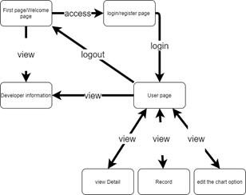</td>
  </tr>
 </table>
 <![endif]><!--[if gte vml 1]></o:wrapblock><![endif]--> 
<o:p></o:p>

Group work

<table class=TableNormal border=1 cellspacing=0 cellpadding=0 style='margin-left:
 60.5pt;border-collapse:collapse;mso-table-layout-alt:fixed;border:none;
 mso-border-alt:solid black .5pt;mso-yfti-tbllook:480;mso-padding-alt:0cm 0cm 0cm 0cm;
 mso-border-insideh:.5pt solid black;mso-border-insidev:.5pt solid black'>
 <tr style='mso-yfti-irow:0;mso-yfti-firstrow:yes;height:17.95pt'>
  <td width=214 valign=top style='width:160.55pt;border:solid black 1.0pt;
  mso-border-alt:solid black .5pt;padding:0cm 0cm 0cm 0cm;height:17.95pt'>
  
member<o:p></o:p>

  </td>
  <td width=315 valign=top style='width:236.15pt;border:solid black 1.0pt;
  border-left:none;mso-border-left-alt:solid black .5pt;mso-border-alt:solid black .5pt;
  padding:0cm 0cm 0cm 0cm;height:17.95pt'>
  
the role each member played in the group<o:p></o:p>

  </td>
  <td width=72 valign=top style='width:54.1pt;border:solid black 1.0pt;
  border-left:none;mso-border-left-alt:solid black .5pt;mso-border-alt:solid black .5pt;
  padding:0cm 0cm 0cm 0cm;height:17.95pt'>
  
percent<o:p></o:p>

  </td>
 </tr>
 <tr style='mso-yfti-irow:1;height:36.1pt'>
  <td width=214 valign=top style='width:160.55pt;border:solid black 1.0pt;
  border-top:none;mso-border-top-alt:solid black .5pt;mso-border-alt:solid black .5pt;
  padding:0cm 0cm 0cm 0cm;height:36.1pt'>
  
Chan Kwan Kit<o:p></o:p>

  </td>
  <td width=315 valign=top style='width:236.15pt;border-top:none;border-left:
  none;border-bottom:solid black 1.0pt;border-right:solid black 1.0pt;
  mso-border-top-alt:solid black .5pt;mso-border-left-alt:solid black .5pt;
  mso-border-alt:solid black .5pt;padding:0cm 0cm 0cm 0cm;height:36.1pt'>
  
front-end side , api and the sql data managment<o:p></o:p>

  </td>
  <td width=72 valign=top style='width:54.1pt;border-top:none;border-left:none;
  border-bottom:solid black 1.0pt;border-right:solid black 1.0pt;mso-border-top-alt:
  solid black .5pt;mso-border-left-alt:solid black .5pt;mso-border-alt:solid black .5pt;
  padding:0cm 0cm 0cm 0cm;height:36.1pt'>
  
55%<o:p></o:p>

  </td>
 </tr>
 <tr style='mso-yfti-irow:2;mso-yfti-lastrow:yes;height:53.85pt'>
  <td width=214 valign=top style='width:160.55pt;border:solid black 1.0pt;
  border-top:none;mso-border-top-alt:solid black .5pt;mso-border-alt:solid black .5pt;
  padding:0cm 0cm 0cm 0cm;height:53.85pt'>
  
Ma Kam Wa<o:p></o:p>

  </td>
  <td width=315 valign=top style='width:236.15pt;border-top:none;border-left:
  none;border-bottom:solid black 1.0pt;border-right:solid black 1.0pt;
  mso-border-top-alt:solid black .5pt;mso-border-left-alt:solid black .5pt;
  mso-border-alt:solid black .5pt;padding:0cm 0cm 0cm 0cm;height:53.85pt'>
  
handle back-end side, part of function and website
  error debugging<o:p></o:p>

  </td>
  <td width=72 valign=top style='width:54.1pt;border-top:none;border-left:none;
  border-bottom:solid black 1.0pt;border-right:solid black 1.0pt;mso-border-top-alt:
  solid black .5pt;mso-border-left-alt:solid black .5pt;mso-border-alt:solid black .5pt;
  padding:0cm 0cm 0cm 0cm;height:53.85pt'>
  
45%<o:p></o:p>

  </td>
 </tr>
</table>

 

<o:p>&nbsp;</o:p>

<h1 style='margin-right:70.4pt;line-height:170%'>installation guide for deployment user manual</h1>

<h2 style='margin-top:10.05pt'>Step 1 prepare the environment:</h2>

Need to prepare Apache , MySQL, and PHP server on your computer. If
you use windows use can install their software:

<o:p>&nbsp;</o:p>

XAMPP Installers and Downloads for Apache Friends <a
href="https://www.apachefriends.org/download.html">https://www.apachefriends.org/download.html</a> WampServer <a
href="https://sourceforge.net/projects/wampserver/">https://sourceforge.net/projects/wampserver/</a>

<o:p>&nbsp;</o:p>

Linux (Ubuntu
use this statement) in the terminal:

sudo apt-get
install apache2 sudo apt-get install mysql-server

sudo apt-get install php libapache2-mod-php php-mysql

<o:p>&nbsp;</o:p>

<o:p>&nbsp;</o:p>

<h2 style='margin-top:0cm'>Step 2 set up the file</h2>

Copy the file in
the apache “www” file

On windows by default on “c:\wamp\www” and
“c:\XAMPP\www” or other location your set.

On Linux the location on “var/www/html”

 

<o:p>&nbsp;</o:p>

<h2>Step 3 setup google reCAPTCHA</h2>

Prepare google reCAPTCHA and Https services Go to this link

Google reCAPTCHA <a href="https://www.google.com/recaptcha/about/">https://www.google.com/recaptcha/about/</a> Click this button

<!--[if gte vml 1]><o:wrapblock><v:shape
  id="image70.png" o:spid="_x0000_s1056" type="#_x0000_t75" alt="一張含有 文字 的圖片  自動產生的描述"
  style='position:absolute;margin-left:1in;margin-top:17.05pt;width:345.2pt;
  height:107.65pt;z-index:35;visibility:visible;mso-wrap-style:square;
  mso-wrap-distance-left:0;mso-wrap-distance-top:0;mso-wrap-distance-right:0;
  mso-wrap-distance-bottom:0;mso-position-horizontal:absolute;
  mso-position-horizontal-relative:page;mso-position-vertical:absolute;
  mso-position-vertical-relative:text'>
  <v:imagedata src="final_report.files/image137.png" o:title="一張含有 文字 的圖片  自動產生的描述"/>
  <w:wrap type="topAndBottom" anchorx="page"/>
 </v:shape><![endif]--><![if !vml]>
 <table cellpadding=0 cellspacing=0 align=left>
  <tr>
   <td width=96 height=0></td>
  </tr>
  <tr>
   <td></td>
   <td>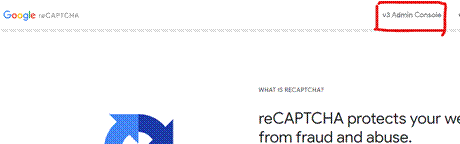</td>
  </tr>
 </table>
 <![endif]><!--[if gte vml 1]></o:wrapblock><![endif]--> 

Click this
button to create new

<!--[if gte vml 1]><o:wrapblock><v:shape
  id="image71.png" o:spid="_x0000_s1055" type="#_x0000_t75" style='position:absolute;
  margin-left:1in;margin-top:7pt;width:47.25pt;height:42.75pt;z-index:36;
  visibility:visible;mso-wrap-style:square;mso-wrap-distance-left:0;
  mso-wrap-distance-top:0;mso-wrap-distance-right:0;mso-wrap-distance-bottom:0;
  mso-position-horizontal:absolute;mso-position-horizontal-relative:page;
  mso-position-vertical:absolute;mso-position-vertical-relative:text'>
  <v:imagedata src="final_report.files/image139.gif" o:title=""/>
  <w:wrap type="topAndBottom" anchorx="page"/>
 </v:shape><![endif]--><![if !vml]>
 <table cellpadding=0 cellspacing=0 align=left>
  <tr>
   <td width=96 height=0></td>
  </tr>
  <tr>
   <td></td>
   <td>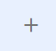</td>
  </tr>
 </table>
 <![endif]><!--[if gte vml 1]></o:wrapblock><![endif]--> 
<o:p></o:p>

Enter all option

<!--[if gte vml 1]><o:wrapblock><v:shape
  id="image72.jpeg" o:spid="_x0000_s1054" type="#_x0000_t75" alt="一張含有 文字 的圖片  自動產生的描述"
  style='position:absolute;margin-left:1in;margin-top:9.7pt;width:446.25pt;
  height:268.25pt;z-index:37;visibility:visible;mso-wrap-style:square;
  mso-wrap-distance-left:0;mso-wrap-distance-top:0;mso-wrap-distance-right:0;
  mso-wrap-distance-bottom:0;mso-position-horizontal:absolute;
  mso-position-horizontal-relative:page;mso-position-vertical:absolute;
  mso-position-vertical-relative:text'>
  <v:imagedata src="final_report.files/image140.jpg" o:title="一張含有 文字 的圖片  自動產生的描述"/>
  <w:wrap type="topAndBottom" anchorx="page"/>
 </v:shape><![endif]--><![if !vml]>
 <table cellpadding=0 cellspacing=0 align=left>
  <tr>
   <td width=96 height=0></td>
  </tr>
  <tr>
   <td></td>
   <td>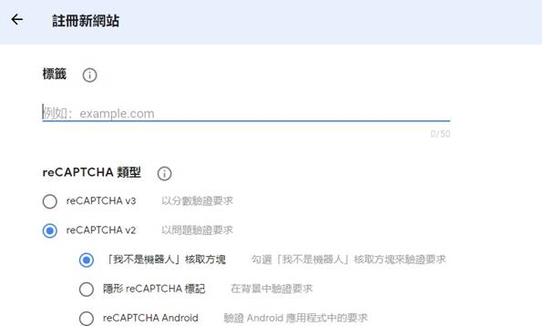</td>
  </tr>
 </table>
 <![endif]><!--[if gte vml 1]></o:wrapblock><![endif]--> 
<o:p></o:p>

 

<o:p>&nbsp;</o:p>

<!--[if gte vml 1]><v:shape
 id="image73.jpeg" o:spid="_x0000_i1026" type="#_x0000_t75" alt="一張含有 文字 的圖片  自動產生的描述"
 style='width:359.25pt;height:198pt;visibility:visible;mso-wrap-style:square'>
 <v:imagedata src="final_report.files/image142.jpg" o:title="一張含有 文字 的圖片  自動產生的描述"/>
</v:shape><![endif]--><![if !vml]>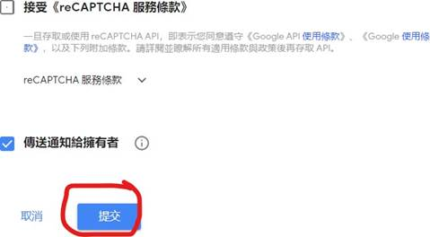<![endif]><o:p></o:p>

<o:p>&nbsp;</o:p>

And click apply

Then you can
have the key for the website

<o:p>&nbsp;</o:p>

<!--[if gte vml 1]><o:wrapblock><v:shape
  id="image74.jpeg" o:spid="_x0000_s1053" type="#_x0000_t75" alt="一張含有 文字 的圖片  自動產生的描述"
  style='position:absolute;margin-left:84.4pt;margin-top:10.65pt;width:321.9pt;
  height:190.45pt;z-index:38;visibility:visible;mso-wrap-style:square;
  mso-wrap-distance-left:0;mso-wrap-distance-top:0;mso-wrap-distance-right:0;
  mso-wrap-distance-bottom:0;mso-position-horizontal:absolute;
  mso-position-horizontal-relative:page;mso-position-vertical:absolute;
  mso-position-vertical-relative:text'>
  <v:imagedata src="final_report.files/image144.jpg" o:title="一張含有 文字 的圖片  自動產生的描述"/>
  <w:wrap type="topAndBottom" anchorx="page"/>
 </v:shape><![endif]--><![if !vml]>
 <table cellpadding=0 cellspacing=0 align=left>
  <tr>
   <td width=113 height=0></td>
  </tr>
  <tr>
   <td></td>
   <td>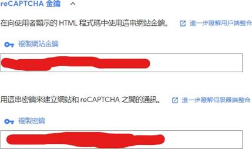</td>
  </tr>
 </table>
 <![endif]><!--[if gte vml 1]></o:wrapblock><![endif]--> 
<o:p></o:p>

<o:p>&nbsp;</o:p>

<o:p>&nbsp;</o:p>

<o:p>&nbsp;</o:p>

Copy the HTML key(top one) on the

<table class=TableNormal border=1 cellspacing=0 cellpadding=0 style='margin-left:
 60.5pt;border-collapse:collapse;mso-table-layout-alt:fixed;border:none;
 mso-border-alt:solid black .5pt;mso-yfti-tbllook:480;mso-padding-alt:0cm 0cm 0cm 0cm;
 mso-border-insideh:.5pt solid black;mso-border-insidev:.5pt solid black'>
 <tr style='mso-yfti-irow:0;mso-yfti-firstrow:yes;mso-yfti-lastrow:yes;
  height:18.1pt'>
  <td width=170 valign=top style='width:127.3pt;border:solid black 1.0pt;
  mso-border-alt:solid black .5pt;padding:0cm 0cm 0cm 0cm;height:18.1pt'>
  
Login_User.php Line 53<o:p></o:p>

  </td>
  <td width=510 valign=top style='width:382.8pt;border:solid black 1.0pt;
  border-left:none;mso-border-left-alt:solid black .5pt;mso-border-alt:solid black .5pt;
  padding:0cm 0cm 0cm 0cm;height:18.1pt'>
  
&lt;div class=&quot;g-recaptcha&quot; id=&quot;g-recaptcha&quot;
  data-sitekey=&quot;&lt;here&gt;&quot;&gt;&lt;/div&gt;<o:p></o:p>

  </td>
 </tr>
</table>

<o:p>&nbsp;</o:p>

Copy the Connection key(Button one) on the

<table class=TableNormal border=1 cellspacing=0 cellpadding=0 style='margin-left:
 60.5pt;border-collapse:collapse;mso-table-layout-alt:fixed;border:none;
 mso-border-alt:solid black .5pt;mso-yfti-tbllook:480;mso-padding-alt:0cm 0cm 0cm 0cm;
 mso-border-insideh:.5pt solid black;mso-border-insidev:.5pt solid black'>
 <tr style='mso-yfti-irow:0;mso-yfti-firstrow:yes;mso-yfti-lastrow:yes;
  height:17.95pt'>
  <td width=274 valign=top style='width:205.3pt;border:solid black 1.0pt;
  mso-border-alt:solid black .5pt;padding:0cm 0cm 0cm 0cm;height:17.95pt'>
  
phpFunction/loginSubmit.php
  Line 30<o:p></o:p>

  </td>
  <td width=406 valign=top style='width:304.8pt;border:solid black 1.0pt;
  border-left:none;mso-border-left-alt:solid black .5pt;mso-border-alt:solid black .5pt;
  padding:0cm 0cm 0cm 0cm;height:17.95pt'>
  
$secret_key
  = '&lt;here&gt;';<o:p></o:p>

  </td>
 </tr>
</table>

 

<o:p>&nbsp;</o:p>

<h2>Step 4 set up HTTPS</h2>

Set the HTTPS services you
may have the HTTPS SSL key for the website. If you don’t want to have use the QR code scanning
function you can bypass this step, if you still want to test this
function without register HTTPS use can use this service:

ngrok - secure
introspectable tunnels to localhost <a href="https://ngrok.com/">https://ngrok.com/</a>

<o:p>&nbsp;</o:p>

<o:p>&nbsp;</o:p>

<h2 style='margin-top:.15pt'>Step 5 set up the SQL</h2>

You should set up the MySQL server and import the SQL statement on
with “webProject.sql” file.

<!--[if gte vml 1]><o:wrapblock><v:shape id="image75.png" o:spid="_x0000_s1052"
  type="#_x0000_t75" alt="一張含有 文字 的圖片  自動產生的描述" style='position:absolute;
  left:0;text-align:left;margin-left:1in;margin-top:17.1pt;width:278.25pt;
  height:124.5pt;z-index:39;visibility:visible;mso-wrap-style:square;
  mso-wrap-distance-left:0;mso-wrap-distance-top:0;mso-wrap-distance-right:0;
  mso-wrap-distance-bottom:0;mso-position-horizontal:absolute;
  mso-position-horizontal-relative:page;mso-position-vertical:absolute;
  mso-position-vertical-relative:text'>
  <v:imagedata src="final_report.files/image146.gif" o:title="一張含有 文字 的圖片  自動產生的描述"/>
  <w:wrap type="topAndBottom" anchorx="page"/>
 </v:shape><![endif]--><![if !vml]>
 <table cellpadding=0 cellspacing=0>
  <tr>
   <td width=96 height=0></td>
  </tr>
  <tr>
   <td></td>
   <td>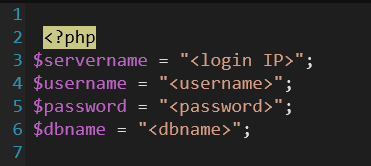</td>
  </tr>
 </table>
 <![endif]><!--[if gte vml 1]></o:wrapblock><![endif]--> 
Then enter the SQL login detail on “phpFunction\StartUp.php”:

<o:p>&nbsp;</o:p>

Finally, all
setup is done.

</body>

</html>

